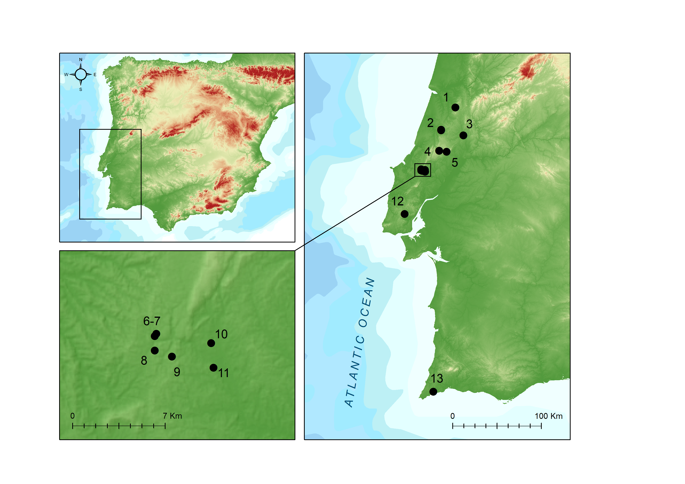
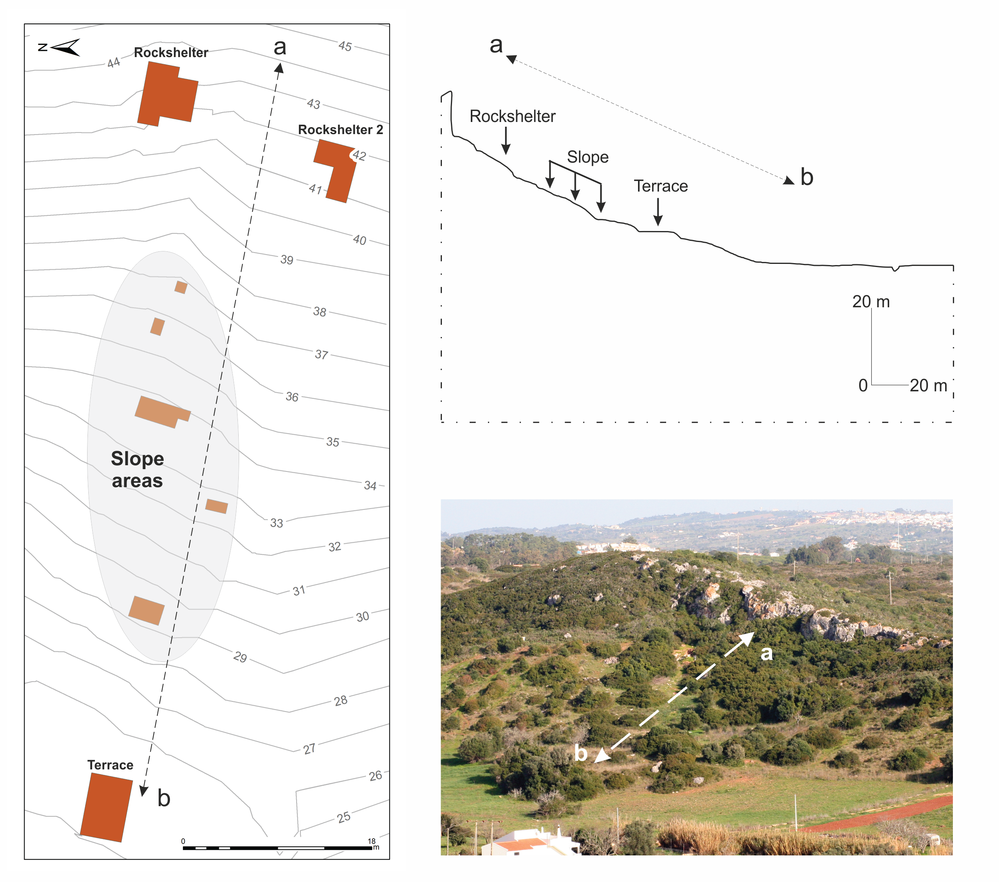
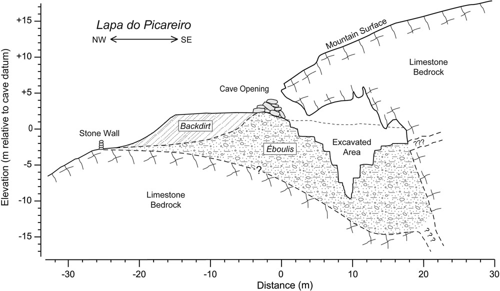
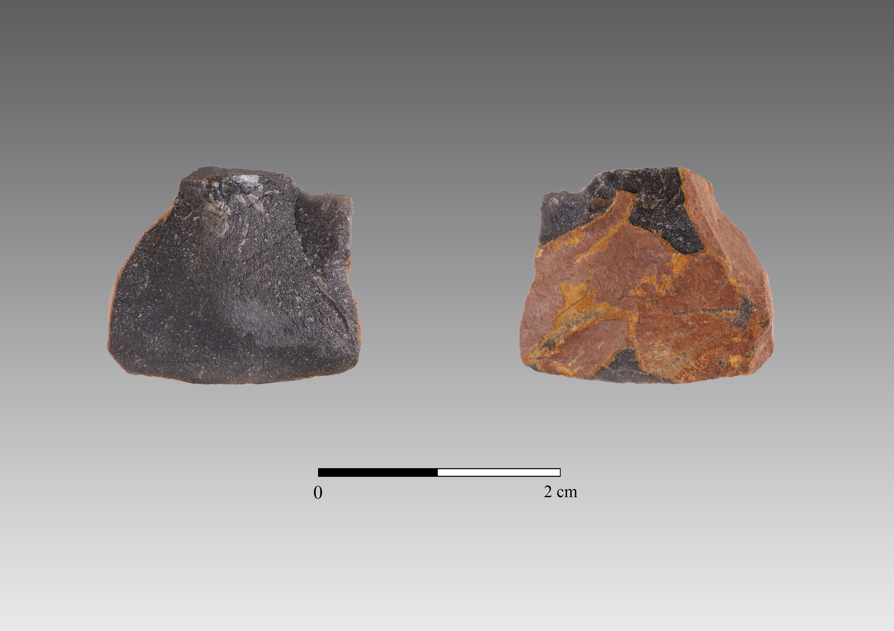

```{r, setup, include = FALSE}
knitr::opts_chunk$set(
  collapse = TRUE,
  warning = FALSE,
  message = FALSE,
  echo = FALSE,
  comment = "#>",
  dpi = 300,
  fig.width = 7,
  fig.ext = "tiff",
  fig.path = "figures/"
  )

# Call packages
library(readr)
library(dplyr)
library(stringr)
library(tidyr)
library(knitr)
library(tab)
library(ggplot2)
library(FactoMineR)
library(factoextra)
library(RcmdrMisc)
library(IDPmisc)
library(forcats)
library(kableExtra)
library(float)
library(janitor)
library(ggpubr)
library(ggExtra)
library(ggsci)
library(ggalluvial)
```


# 1 Introduction

The replacement of the Gravettian technocomplex by the Solutrean, impacted by adverse climatic conditions during the Heinrich event 2 (HE2), continues to be an essential topic to understand the Upper Paleolithic evolution and human adaptations to climatic changes at the end of the Pleistocene.

In fact, there has been a significant amount of proposals suggesting a full synchronism between the onset of each Upper Paleolithic technocomplex and the occurrence of the most severe climate events [@cascalheiraandbicho2013; @bichoetal2017]. Bradtmöller *et al.* [-@bradtmoller2012] suggest a direct relationship between three of the HEs (4, 3 and 2) and the substitution of Neanderthal populations with the emergence of the Aurignacian, the appearance of the Gravettian, and the development of the Solutrean, respectively (Table \@ref(tab:climatetable)). Based on the theoretical framework of Panarchy [@holling2002], the authors propose the Repeated Replacement Model (RRM), where the HEs are understood as the primary climatic triggers for population turnover, through the breakdown of communication networks and cultural traditions, which were subsequently reorganized under different socio-cultural conditions [@bradtmoller2012].

```{r climatetable}
climate_table <- as_tibble(read_csv("data/Rawdata/climate_table.csv"))
knitr::kable(climate_table,
             digits = 2,
             row.names = FALSE,
             caption = "Correspondence between Upper Paleolithic cultural phases (Aurignacian, Gravettian and Solutrean), Heinrich Events and D-O cycles, with respective chronology. Following dates and chronologies from Bradtmöller et al. (2012), Cascalheira and Bicho (2013), Sanchéz-Goñi and Harrison (2010).")
```

In this framework, the rapid climatic changes brought by the HE 2 were the trigger for the reorganization of human groups after the Gravettian. Records indicate that during HEs, and with particular severity in the HE 2, western and southern Iberia must have experienced abrupt environmental changes, which altered the location, abundance and availability of resources for the communities of hunter-gatherers [@cascalheiraandbicho2013]. This led to the development of the Solutrean, marked by harsher evironmental conditions at the onset of the LGM. A technological continuum with clear succession between the two technocomplexes is seen, at least in Iberia [@bradtmoller2012], making the comprehension of these rapid climatic events of extreme importance for the understanding of human cultural change, specifically for the Proto-Solutrean and Solutrean technocomplexes.

However, in order to fully understand the impact of the HE 2 and the environmental changes on the replacement of the Gravettian technocomplex by the Solutrean as mentioned above, the Proto-Solutrean needs to be understood and regarded as an independent unit, as a means to understand its role in the RRM. This issue has been addressed by Cascalheira and Bicho (2013), where within the RRM, the authors suggest the Proto-Solutrean as a moment of creative destruction [@holling2001], which allowed the separation from the Gravettian cultural system to the development of a new structure, the Solutrean. There is, however, the need for more technological and chronological data in order to understand how the many different pieces fit together in this framework.

Although an essential piece to understand how hunter-gatherer communities adapted, reinvented and abandoned their social and technological organization, most of what is known for the Proto-Solutrean is still geographically constricted and lacking good chronological markers [@cascalheiraandbicho2013], which hampers the understanding of the Proto-Solutrean solutions and their role in the Gravettian-Solutrean transition.

Result of the study of materials from old excavations by Manuel Heleno in Rio Maior (Portuguese Estremadura), and new archaeological works in the same region, in the 1980s, the Proto-Solutrean has thus been described as a transitional technocomplex from Gravettian to Solutrean technologies, through a process of local development, and synchronous to all of southwestern Europe [@zilhaoetal1999]. 

This technocomplex is best known in the Portuguese Estremadura (as abovementioned), encompassing open-air and cave sites (Figure \@ref(fig:protomap)).

```{r protomap, fig.cap="Location of Proto-Solutrean sites in Portugal or with Proto-Solutrean finds, including the two sites analysed in this study. Legend: 1-Buraca Escura; 2-Alecrim e Lagar Velho; 3-Caldeirão; 4-Lapa do Anecrial; 5-Lapa do Picareiro; 6-Terra do José Pereira; 7-Terra do Manuel; 8-Vales de Senhora da Luz; 9-Vale Comprido - encosta; 10-CPM III; 11-Gato Preto; 12-Gruta das Salemas; 13-Vale Boi"}

```

The Gravettian-Solutrean transition has been described through several phases, each with its technological characteristics and patterns. Through the techno-typological characteristics of assemblages from key-sites, two models were created: the Two-stage model and Three-stage model [@zilhao1994; @zilhao1997; @zilhaoetal1999].

The Two-stage model starts with a final Gravettian stage, characterized by a moderate use of quartz (~15%), production of truncated backed bladelets and proto-magdalenian retouch blades [@zilhao1997]. The second stage is the Proto-Solutrean, frequently characterized by a high percentage of quartz use (~30%), rare presence of backed bladelets or, when retouch is present, being marginal, and the production of Vale Comprido points, the technocomplex’s index fossil [@almeida2000; @zilhao1997; @zilhaoetal1995]. For the production of these tools, the Proto-Solutrean shows three different operative sequences: one for the production of Vale Comprido points, through the removal of elongated blanks with convergent profiles and thick platforms; another for the production of blades, of Gravettian tradition; and another for the production of bladelets, probably obtained through the exploitation of thick endscapers or carinated elements [@zilhao1997].

Vale Comprido points are described as robust pieces, often characterized by convergent shapes, triangular cross-sections and plain platforms, often having a high elongation ratio, although not necessarily falling into the blade category. The Vale Comprido points have been used to describe the technological transition between the Proto-Solutrean and the Solutrean. In this case, these points are seen as an element of discontinuity with the previous technocomplex, where the organic points armed with microliths from the Gravettian are replaced by lithic points, with enough similarities to the *pointes à face plane* of the Middle Solutrean to be understood as a technological development [@zilhao2013].

The Three-stage model maintains the first final Gravettian stage and its defining characteristics but subdivides the following Proto-Solutrean stage in two. As such, there is an intermediate stage characterized by the intensive use of quartz (~30%), which corresponds to Laugerie-Haute’s Aurignatian V. The third stage is the Proto-Solutrean, where quartz use diminishes. In this model, the Vale Comprido points and associated reduction sequence may appear in either of the last two stages [@zilhao1997]. Alternatively, in the Two-phase model, the Aurignacian V is understood as a functional facies, related to specialized occupations and production activities within the technocomplex.

Regardless of what model is accepted, the Proto-Solutrean, from the beginning of its transitional stage, stands as a technocomplex with technological innovations. These are reflected in the manufacture of Vale Comprido points and a complete operative sequence for their production, but marked by a high degree of technological variability in their lithic assemblages [@almeida2000; @zilhao1997; @zilhaoetal1999].

This variability has been interpreted as a technological race in response to the environmental modifications taking course during the HE 2 [@cascalheiraandbicho2013]. The authors suggest that, in order to correspond to the external pressures, there may have been the need to diversify the economic strategies in use until that moment. The high exploitation of quartz, for example, formerly a secondary raw material, and the use of similar reduction strategies between quartz and chert, might represent one such economic response. The same possibly applies to the use of unprecedented raw materials, as is the case of the Proto-Solutrean levels in Vale Boi, where there is the presence of previously unknown raw materials, used mainly in the manufacture of Vale Comprido points [@belmiro2017; @marreiros2009]. Likewise, alterations recorded in territoriality patterns for the Proto-Solutrean can be interpreted has extensive regional networks and may be related to modifications in the landscape that occurred during the HE 2 [@cascalheiraandbicho2013; @cascalheira2019].

These technological and behavioral changes, when understood under the light of the Repeated Replacement Model previously discussed [@bradtmoller2012] and Panarchy [@holling2002; @allen2014], might be understood as moments of release and restructuration led by external pressures, in this case, climate changes [@cascalheiraandbicho2013], while maintaining a certain degree of resilience [@bicho2013; @walker2006]. 

Thus, following this framework, the Proto-Solutrean reveals itself as a moment of “creative destruction” [@holling2001], with moments of rupture and consolidation of technological innovations and social structures. In other words, the Proto-Solutrean might be understood as the moment where Gravettian cultural traditions were reconfigured to best adapt to climatic and landscape alterations, setting grounds for the emergence of another phase – the Solutrean [@cascalheiraandbicho2013].

However, despite the existence of rather comprehensive literature about the technocomplex in the Portuguese Estremadura, which has allowed for a better understanding of the impacts of HE 2 in hunter-gatherer communities and the emergence of the Solutrean, there is still the need for further studies, in order to fill existing gaps. One of these gaps is the concentration of data regarding this technocomplex in the Estremadura, whereas the Proto-Solutrean is still relatively unknown in other places throughout southwestern Europe, in the case of Portugal, with only one site in the south (Figure \@ref(fig:protomap)). Another issue abovementioned is connected to the small amount of absolute datings for Proto-Solutrean contexts, which limits the chronological definition of the technocomplex, and thus the testing of which transition model (if any) applies best [@cascalheiraandbicho2013].

Addressing these issues, through the study of Proto-Solutrean lithic assemblages from other areas in the southwestern European territory, from sites with good stratigraphic preservation which allow absolute dating and accurate spatial tracking, will undoubtedly help further understand this technocomplex, its patterns, stage transitions and possible regional variations.

By understanding the need to better comprehend the Proto-Solutrean and how abrupt climate change impacted these communities, this study's primary goal was to answer provide additional details to answer the question: what impact did the HE 2 have on the technological organization of human communities, at the onset of the Last Glacial Maximum (LGM), in southwestern Iberia? To do so, an analysis of stone tool assemblages coming from levels attributed to the Gravettian-Solutrean transition timeframe, from two recently excavated sites - Vale Boi (southern Portugal) and Lapa do Picareiro (central Portugal) - was performed.

To answer this question, the following goals were set: 1) understand the technological organization of Layers 5/4E of Vale Boi, and U/T from Lapa do Picareiro, by characterizing their technological patterns, reduction sequences and raw material use/preference patterns; 2) identify possible Terminal Gravettian horizons or facies within the Proto-Solutrean occupations in Vale Boi and Lapa do Picareiro and their respective chronologies; 3) test the Gravettian-Solutrean transition models (Two-phase and Three-phase), previously developed using data from the Portuguese Estremadura [@zilhao1997], to understand which model best explains the transition, but also if those patterns can be applied to other geographic areas outside of the Estremadura.


# 2 Archaeological sites

## 2.1 Vale Boi

Vale Boi is an open-air site and rockshelter, located on the western coast of Algarve (Portugal), near a small homonymous village, within the municipality of Vila do Bispo (Figure \@ref(fig:protomap)). The site is situated in a small valley that runs south to the Atlantic coast, about 2 km distance, relatively open, with a natural boundary to the east and bordered by a limestone hill through all its extension. This hill is marked, at specific points, by limestone exposures that form rock shelters with faces facing west or southwest (Figure \@ref(fig:vbphoto))[@bicho2003; @cascalheira2010; @cascalheiraetal2008].

```{r vbphoto, fig.cap="Vale Boi. Topographic plan, schematic profile and general view, with location of the excavation loci. After Cascalheira et al. (2017)."}



```

The site extends for more than 10 000 $m^2$ on the slope of this valley, which is marked by a series of steps that run parallel to the river, possibly the result of Middle Pleistocene fluviatile erosion [@bicho2003].

The geological context of Vale Boi is marked by heterogeneity. In the north, there are schist and greywacke formations from the Carboniferous. In the south, Triassic and Jurassic dolomite and limestone formations, which are gradually covered by Holocene dunes further into the coastal area, until near St. Vincent’s cape where they appear uncovered once again, along with small occurrences of chert [@verissimo2004].

Vale Boi shows a variety of human occupations, distributed across the three main areas, which have been interpreted differently in terms of functionality: Slope, Shelter, and Terrace.

Although excavated since 2000, in 2012, a new 8 $m^2$ area was open in the Terrace (rows H and I), to understand the stratigraphic sequence in more detail and assess the existence of older cultural horizons, from the early Upper Paleolithic.

## 2.2 Lapa do Picareiro

Lapa do Picareiro is a cave site on the west facing slope of Serra d’Aire, a limestone massif north of the Tagus River valley and Lisbon, Portugal (Figure \@ref(fig:protomap)) [@benedettietal2019; @bicho2006]. The massif is underlain by the Serra d’Aire formation, a thick-bedded limestone of the Middle Jurassic age [@carvalho2018]. Serra d’Aire is part of a large limestone province (Maciço Calcário Estremenho), which accounts for several Palaeolithic occupations, both cave and open-air sites [@almeida2000; @benedettietal2019].

The interior of the chamber is about 11 x 14 m, and has more than 10 m of coarse sedimentary infill in inclined beds, derived from roof collapse, gravity flows and fine sediment infiltration (Figure \@ref(fig:lpcave)) [@benedettietal2019]. The cave opening is marked by the existence of a large limestone cone of stone blocks [@bicho2006] while the sediment inside the cave consists of smaller and angular limestone clasts in a matrix of fine sediment [@benedettietal2019].

Until the present year 34 layers have been identified within the cave, 20 of which have human occupations attributed to the Upper Paleolithic.

```{r lpcave, fig.cap="Lapa do Picareiro. Generalized cross section showing surface topography, shape of the cave, and area excavated into sedimentary fill. After Benedetti et al. (2019)."}



```

# 3 Material and methods

## 3.1 Materials

The materials used for this analysis come for the abovementioned archaeological sites Vale Boi and Lapa do Picareiro. The materials from Vale Boi include all lithic artifacts from layers 5 and 4E, from the Terrace area and from units H to J, excavated from 2012 onwards. Lapa do Picareiro materials include all lithic artifacts from levels T, U and T/U.

These materials are located at the laboratory of the Interdisciplinary Center for Archaeology and Evolution of Human Behaviour (ICArEHB), at the Universidade do Algarve, in Portugal.

## 3.2 Attribute analysis

The present study adopted an attribute analysis methodology, which aims to recover morphological and metrical attributes of technological classes. The attributes analyzed followed those previously used in European and Portuguese contexts for the Upper Paleolithic [see @bicho1992; @zilhao1997; @almeida2000; @cascalheira2013].

For this study, all artifacts and their technological and morphological attributes were recorded using two different databases, thus dividing the analysis in two phases: basic and complete attribute-based analysis.

In both cases, data collection was done through E4, a software developed by Dibble and McPherron (2003), available for download at http://www.oldstoneage.com/software/default.shtml. The software allows the user to program a database file which filters variables through conditions, defined by previous choices and attributes, which allows for better control of the database and homogeneous results. After recording, all information is gathered in one single database in an Access type output.

The basic analysis was applied to all of Vale Boi’s quartz artifacts (layers 5 and 4E), since all lithics from the same assemblage in other raw-materials (*e.g.* chert and greywacke) had been previously analysed with the same database  [see @belmiro2018]. This database consists of a reduced set of variables which allow for the general classification of metric and morphologic characteristics of the artifacts, as well as the identification of raw material preference and preferential use. These main variables were: 1) raw material; 2) technological class, following the traditional criteria for lithic technological analysis [@andrefsky1998; @bicho2011; @debenath1994; @inizan1999]; percentage of cortex [@bicho2011]; weight and mesial thickness, maximum width and maximum length. Retouched pieces were classified into wider groups regarding their morphologies and retouch type, following the typologies defined by @sonneville-bordes1956,  adapted by @zilhao1997 for the Portuguese Estremadura.

The complex analysis was applied to Vale Boi cores, debitage products and retouched pieces. Only pieces which were complete were chosen for this stage for two main reasons: 1) the collection is well preserved, with high percentages of complete cores and blanks (~80%), guaranteeing that the sample is representative; 2) only complete pieces gather all the necessary attributes for a thorough analysis. The same database was applied to the whole assemblage of Lapa do Picareiro, given its small sample size.

The several attributes analysed in this database follow those present in specialized literature, such as @brezillon1968 and @tixier1980, paired with the methodologies used in Upper Paleolithic lithic attribute analysis works, such as @bicho1992, @zilhao1997 or @almeida2000. 

The complete Data Dictionary with all variables, attributes, values and description, with reference to the consulted literature can be found in the supplementary material (Table \@ref(tab:datadictionary).

Regarding cores, the following variables were registered: section, type of platform and number of platforms, core morphology, following the types defined by @bicho1992 and @brezillon1968, percentage of cortex, types and number of extracted products (with maximum, proximal, mesial and distal measurements of the final extraction) and reason for abandonment. When cores showed more than one face, a dominant debitage face was established, which allowed for the orientation of the artifact and recording of some of the variables (*e.g.* measurements of final extraction).

For debitage products and EMNP, their technological class, morphology, section and profile were recorded, following the definitions by @zilhao1997. Other determined attributes were the presence of lipping and type of platform, according to @inizan1999, percentage of cortex and amount of dorsal extractions and direction (> 5 mm) [@scerri2015]. Retouched pieces were classified into wide groups as applied in the simple database, following once again the typologies defined by @sonneville-bordes1956, adapted by @zilhao1997 for the Portuguese Estremadura. 

In what concerns to the technological classes, the values recorded were core, blank, retouched piece and core preparation product following traditional analysis criteria [@andrefsky1998; @bicho2011; @debenath1994; @inizan1999], but collapsing both flakes and elongated blanks in a single category. The difference between flake and elongated blank is traditionally defined by a ratio between length and width measurements. Elongated blanks are defined as products where length is equal or greater than twice their width [@bicho2011; @tixier1980]. Very frequently, this ratio is blurred, resulting in elongated flakes or short elongated blanks, which may result in incorrect classifications. In understanding both flakes and elongated blanks as a whole, without prior classification, and using the measurements recorded if needed, we achieve the same results without the need to find classification mistakes and without delving into typologies which may not have any real technological significance. The same methodology was applied regarding the definition of bladelet and blade. As traditionally defined, bladelets are elongated blanks with maximum width of 12 mm, whereas blades are elongated blanks with more than 12 mm of width or more than 50 mm of length [@tixier1963]. For the present study, this typological differentiation was not applied during the analysis, since it may be achieved, if needed, with the recorded measurements. 

The measurements were registered equally for debitage products and cores, including maximum length, width (proximal, mesial and distal), thickness, platform width and thickness and platform angle according to @dibble1997.

Finally, although raw material had been previously analysed during the simple attribute analysis, quartz artefacts were subdivided regarding raw material quality. When analysing the quartz lithic collection, it was apparent that fracture patterns and product morphology differed greatly between quartz and other raw materials and even within types of quartz. In fact, it is understood that applying the same analysis variables to all raw materials, especially quartz, may not be the most appropriate methodology, since different technological solutions might be applied to materials which react differently to knapping [@beardsell2013]. Despite this, creating a different database or establishing different analysis attributes for quartz would result in different issues and problems that would require further testing and experimenting. Thus, in order to understand possible preferential uses or mechanical constraints of quartz, this raw material was analysed with the same attributes as other raw materials, but further classified regarding its quality. In fact, @almeida2000 stated that, for the Terminal Gravettian, raw material quality, namely the quartz, resulted in specific behaviors and different technological patterns. By defining quartz quality and understanding the collection through this added variable, it was our goal to better comprehend the cultural horizon in its fullest, and allow comparison to other studies, in which similar variables were considered. 

Quartz quality was defined by grain size: coarse quality was applied to every quartz artifact that displayed large and visible grains (>0.5 mm); medium quality was applied whenever the grains were visible but small (<0.5 mm); fine quality was defined by the absence of visible grains; and rock crystal was applied whenever there was the absence of visible grains, but where the minerals were translucent.

## 3.3 Data analysis

After data collection, the databases, for both Vale Boi and Lapa do Picareiro, were imported into R environment, where the information was processed through the creation of descriptive statistical analysis. This was done in RStudio, an open source integrated development environment (IDE) for R, which can be downloaded at https://rstudio.com, also with resource to RMarkdown, which allows the production of fully reproducible documents (downloaded at https://rmarkdown.rstudio.com).

The scripts used for all statistical analyses and the production of this paper can be found in the supplementary materials.

# 4 Results

```{r VB_analysis_setup, include=FALSE}

# Read db
context <- read_csv("data/Rawdata/context.csv") #Field DB
xyz <- read_csv("data/Rawdata/xyz.csv") #Field DB
lithics <- read_csv("data/Rawdata/Basedados_VB.csv") #Analysis DB

# Df cleaning and uniformizing
cols_to_concat <- c("Unit", "ID")
context$ID <- str_squish(context$ID) #remove empty spaces from ID field
xyz$ID <- str_squish(xyz$ID) #remove empty spaces from UNIT field

# Concatenate ID and UNIT variables in one single variable (e.g. A6-100)
context <- context %>%
  unite_(col='id', cols_to_concat, sep="-", remove=FALSE) %>%
  select(id, Spit, Level, Code) %>%
  distinct(id, .keep_all = TRUE)

xyz <- xyz %>%
  dplyr::rename(Unit = UNIT) %>%
  unite_(col='id', cols_to_concat, sep="-", remove=FALSE) %>%
  filter(Suffix == 0) %>%
  select(id, X, Y, Z) %>%
  distinct(id, .keep_all = TRUE)

# Classify complete blanks (into flake or elongated) according to W and L ratio
lithics <- lithics %>%
  dplyr::rename(Unit = UNIT) %>%
  unite_(col='id', cols_to_concat, sep="-", remove=FALSE) %>% 
  mutate(elong = MaxWidth*2-Length) %>% 
  mutate(BlankType = case_when(
    Class == "Blank" & elong > 0 ~ "Flake",
    Class == "Blank" & elong <= 0 ~ "ElongatedProd")) %>% 
  as.data.frame()

# Join both tables and (optionally) write csv with final result
field_data <- full_join(xyz, context, by = "id")

# Join field and lithic tables
dataset <- left_join(lithics, field_data, by = "id")

# Force transform 'dataset' into a data.frame
dataset <- as.data.frame(dataset)

# Attribute phase based on depth (Z)
dataset <- dataset %>% 
  mutate(Phase = case_when(
    Z > 24.1 ~ "Upper 5/4E",
    Z < 24.1 ~ "Lower 5"))


```

```{r lp_analysis_setup, include=FALSE}

lithicslp <- read_csv("data/Rawdata/Basedados_LP.csv")
xyzlp <- read_csv("data/Rawdata/xyzlp.csv")
cols_to_concat <- c("UNIT", "ID")
xyzlp$ID <- str_squish(xyzlp$ID)

lithicslp <- lithicslp %>% 
  dplyr::rename("UNIT" = "X5") %>% 
  unite_(col='ID', cols_to_concat, sep="-", remove=FALSE)

xyzlp <- xyzlp %>%
  unite_(col='ID', cols_to_concat, sep="-", remove=FALSE) %>%
  filter(SUFFIX == 0) %>%
  select(ID, X, Y, Z) %>%
  distinct(ID, .keep_all = TRUE)

# Classify complete blanks (into flake or elongated) according to W and L ratio
lithicslp <- lithicslp %>%
  mutate(elong = MaxWidth*2-Length) %>% 
  mutate(BlankType = case_when(
    Class == "Blank" & elong > 0 ~ "Flake",
    Class == "Blank" & elong <= 0 ~ "ElongatedProd")) %>% 
  select(-elong)

datasetlp <- left_join(lithicslp, xyzlp, by = "ID")

datasetlp <- as.data.frame(datasetlp)

# Attribute phase based on depth (Z)
datasetlp <- datasetlp %>% 
  mutate(Phase = case_when(
    Z >= 566.9 | Level == "T1" | Level == "T2" | Level == "T3" | Level == "T4" | Level == "T5" ~ "Middle T",
    Z < 566.9 | Level == "T6" | Level == "T7" | Level == "T8" | Level == "U" | Level == "U1" ~ "U/Lower T"))

```

## 4.1 Vale Boi

### 4.1.1 Assemblage and raw materials

Given the possible existence of two phases within the Proto-Solutrean occupations (Three-phase model), we calculated the percentages of the three most important raw materials by cubic meter of excavated sediment (Figure \@ref(fig:rmdispersion)) and plotted them by depth. There seem to be significant differences in raw material distribution over time. From around 24.1 m of depth upwards, there is an important shift in quartz and chert frequencies, the latter increasing more than 10%, and quartz dropping from c. 50% to nearly 30%. Greywacke frequencies follow those of quartz.

This shift seems to be associated with other significant changes in the Terrace sequence, such as an increase in the amount of lithic materials in top of Layer 5 and Layer 4E, but also the appearance of Vale Comprido technology. Additionally, these two moments are stratigraphically correlated with two different chronological horizons, the first, dated to c. 26 ka cal BP, at c. 23.9 m depth, and associated with higher frequencies of quartz, and the second, dated to c. 24.7 ka cal BP, at around 24.1 m depth, associated with higher frequencies of chert and a reduction in quartz presence.

```{r rmdispersion, fig.cap = "Vale Boi. Raw material discard rates over time. Each point is an excavation unit (spit). The lines are locally weighted regression lines (span ¼ 0.4) to aid in visualising the trend of increased discard in the upper part of the deposit.", echo = FALSE, message=FALSE, warning=FALSE}

# Calulate spit volumes
cols_to_concat <- c("Level", "Spit")

buckets_by_spit <- context %>%
  filter(Level %in% c("4E", "5", "5B", "5C") & Code == "BUCKET" & !Spit %in% c("limp_corte", "profile", " ", NA)) %>%
  unite_(col='depth', cols_to_concat, sep=".", remove=FALSE)

buckets_by_spit$depth <- str_replace(buckets_by_spit$depth, "B", "")
buckets_by_spit$depth <- str_replace(buckets_by_spit$depth, "C", "")

spit_vol <- buckets_by_spit %>%
  dplyr::group_by(depth) %>%
  dplyr::count(Code) %>%
  mutate(spit_vol = (n*10)/1000)

# Calculate average depth of spits

spit_depths <- field_data %>%
  filter(Level %in% c("4E", "5", "5B", "5C") & !Spit %in% c("limp_corte", "LIMP_CORTE", "profile", " ", NA, "0")) %>%
  unite_(col='depth', cols_to_concat, sep=".", remove=FALSE)

spit_depths$depth <- str_replace(spit_depths$depth, "B", "")
spit_depths$depth <- str_replace(spit_depths$depth, "C", "")

spit_aver_depths <- spit_depths %>%
  dplyr::group_by(depth) %>%
  dplyr::summarise(avg = mean(Z)) %>%
  mutate_if(is.numeric, format, 3)

## Data classes per spit

cols_to_concat <- c("Level.y", "Spit")

lithics_by_spit <- dataset %>%
  filter(Level.y %in% c("4E", "5", "5B", "5C") & !Spit %in% c("limp_corte", "profile", " ", NA)) %>%
  select(id, Z, Spit, Level.y, Code, Class, ChipQuantity, RetouchedPieceTypology, PieceCompleteness, RawMaterial) %>%
  unite_(col='depth', cols_to_concat, sep=".", remove=FALSE)

lithics_by_spit$depth <- str_replace(lithics_by_spit$depth, "B", "")
lithics_by_spit$depth <- str_replace(lithics_by_spit$depth, "C", "")

#Debitage by spit

cols_to_concat <- c("Level.y", "Spit")

rm_by_spit <- dataset %>%
  filter(Level.y %in% c("4E", "5", "5B", "5C") & !Spit %in% c("limp_corte", "profile", " ", NA)) %>%
  select(id, Z, Spit, Level.y, Code, RawMaterial, QuartzQuality, Class) %>%
  unite_(col='depth', cols_to_concat, sep=".", remove=FALSE) %>% 
  filter(Class %in% c("Blank","Core","RetouchedPiece"))

rm_by_spit$depth <- str_replace(rm_by_spit$depth, "B", "")
rm_by_spit$depth <- str_replace(rm_by_spit$depth, "C", "")

rm_by_spit <- rm_by_spit %>% 
  dplyr::group_by(depth) %>%
  dplyr::count(RawMaterial) %>%
  mutate(freq = n / sum(n)*100)

quartz_by_spit <- rm_by_spit %>%
  filter(RawMaterial == "Quartz")

chert_by_spit <- rm_by_spit %>% 
  filter(RawMaterial == "Chert")

grey_by_spit <- rm_by_spit %>% 
  filter(RawMaterial == "Greywacke")

quartz_by_spit$spit_vol <- spit_vol$spit_vol[match(quartz_by_spit$depth, spit_vol$depth)]
quartz_by_spit <- quartz_by_spit %>%
  mutate(artifacts_by_cubic_meter = n/spit_vol)
quartz_by_spit$spit_aver_depth <- spit_aver_depths$avg[match(quartz_by_spit$depth, spit_aver_depths$depth)]
quartz_by_spit$spit_aver_depth <- as.numeric(as.character(quartz_by_spit$spit_aver_depth))

chert_by_spit$spit_vol <- spit_vol$spit_vol[match(chert_by_spit$depth, spit_vol$depth)]
chert_by_spit <- chert_by_spit %>%
  mutate(artifacts_by_cubic_meter = n/spit_vol)
chert_by_spit$spit_aver_depth <- spit_aver_depths$avg[match(chert_by_spit$depth, spit_aver_depths$depth)]
chert_by_spit$spit_aver_depth <- as.numeric(as.character(chert_by_spit$spit_aver_depth))

grey_by_spit$spit_vol <- spit_vol$spit_vol[match(grey_by_spit$depth, spit_vol$depth)]
grey_by_spit <- grey_by_spit %>%
  mutate(artifacts_by_cubic_meter = n/spit_vol)
grey_by_spit$spit_aver_depth <- spit_aver_depths$avg[match(grey_by_spit$depth, spit_aver_depths$depth)]
grey_by_spit$spit_aver_depth <- as.numeric(as.character(grey_by_spit$spit_aver_depth))

rm_by_cubic_meter <- bind_rows(quartz_by_spit, chert_by_spit, grey_by_spit)

rm_by_cubic_meter <- filter(rm_by_cubic_meter, spit_vol > 0.10) # removes low volumetric levels


# Plot

rm_cubic_meter <- ggplot(rm_by_cubic_meter, (aes(spit_aver_depth, freq, colour = RawMaterial))) +
  geom_point() +
  stat_smooth(span = 0.5, se = FALSE) +
  xlab("Depth (m)") +
  ylab("Artefact relative frequency by cubic meter of sediment (log10)") +
  theme(axis.text=element_text(size=12),
        axis.title.x = element_text(size = 14),
        axis.title.y = element_text(size = 14),
        legend.text = element_text(size= 12),
        legend.title = element_text(size = 14)) +
  scale_y_log10()+
  coord_flip() +
  scale_color_jco()

rm_cubic_meter
```

Given the chronological data, density of artifacts, and raw material preference patterns, it was decided that for this study the materials would be subdivided in two analytical units, to better understand any possible technological differences: **Lower 5**, including all artifacts with Z values under 24.1; **Upper 5/4E**, including all artifacts with Z values of 24.1 and above. The value 24.1 is arbitrary and was chosen for the reasons aforementioned: it seems to be where the separation between higher and lower densities of lithic materials occurs and, also, where the inversion of quartz and chert frequencies happens.

A total of 26,703 pieces were analysed for both groups, 11,094 from Lower 5 group (Table \@ref(tab:general1)) and 15,609 for the Upper 5/4E (Table \@ref(tab:general2)). Most of these are chips (70.62% from Lower 5 and 65.68% from Upper 5/4E), followed by shatters, which make up c. 21% and c. 24% of the groups, respectively. These extremely high numbers for debris are mostly the result of quartz use, which can be explained not only by on-site knapping of this raw material but mostly by its breakage patterns (especially when coarser), which typically produces more waste than in other raw materials.

For Lower 5, cores and debitage products represent a cumulative frequency of c. 8%. For Upper 5/4E, debitage products represent nearly 10% of the group's assemblage. Complete blanks are the most represented class for both groups, with 1,474 identified pieces, 4.59% for Lower 5 and 6.18% for Upper 5/4E, followed by blank fragments, with an absolute count of 248 for Lower 5 and 336 for Upper 5/4E. Cores are also relatively frequent within these assemblages, with an absolute count of 123 cores, 46 for Lower 5 and 77 for Upper 5/4E, while core fragments appear in much smaller numbers (n=11 and n=14, respectively).

During the analysis, 167 retouched pieces were identified, 55 on Lower 5, representing 0.5% of the group, and 112 on Upper 5/4E, with a frequency of 0.72%. Retouched piece fragments appear in much smaller numbers (n=7 for Lower 5 and n=16 for Upper 5/4E).

One of the most relevant raw materials in both of Vale Boi's analytical units used for this study is quartz (encompassing rock crystal, fine, medium and coarse qualities), which represents c. 43% of the total assemblage for the Upper 5/4E group, and c. 51% for Lower 5. Chert, on the other hand, represents c. 46% of the Upper 5/4E phase and 38% of the Lower 5. Finally, greywacke, dolerite, chalcedony, and other raw materials that due to their low frequencies were collapsed in the category “Other”, together represent c. 11% of both assemblages (Figure \@ref(fig:rmvb)).

```{r rmvb, fig.cap="Vale Boi. Frequencies of raw materials by phase. Chips and shatters not included.", echo=FALSE}

dfRM_vb <- dataset %>% 
  filter(Class!="Chip") %>% 
  filter(Class!="Shatter") %>% 
  drop_na(Phase)

dfRM_vb %>%
  mutate(RawMaterial = factor(RawMaterial, levels = c("Quartz","Chert","Greywacke","Dolerite","Chalcedony","Other"))) %>%
  dplyr::group_by(Phase, RawMaterial) %>% 
  dplyr::summarise(n = n()) %>%
  mutate(percent = n/sum(n)) %>% 
  ggplot(aes(x=Phase, y = percent, fill = RawMaterial)) +
  geom_bar(stat = "identity", width = 0.5) +
  scale_y_continuous(labels = scales::percent_format()) +
  theme_minimal() + #type of theme
  labs(x = "Phases", y = NULL) +# change labels
  guides(fill=guide_legend(title=NULL)) + # remove legend title
  geom_text(aes(label=ifelse(percent >= 0.07, paste0(sprintf("%.0f", percent*100),"%"),"")),
                position=position_stack(vjust=0.5), colour="white") +
  theme(axis.title.x = element_text(size = 10, vjust = -1)) +
  scale_fill_jco()

```

The number of chips and shatter in quartz are extremely high, both in its representativity within the raw material, with c. 94% for both Lower 5 and Upper 5/4E, and when compared to the relative frequencies of other raw materials.

Despite the low frequencies presented on the table, there is a large number of quartz blanks (n=281 for Lower 5 and n=438 for Upper 5/4E) compared to the rest of the classes, as well as cores (n=18 for Lower 5 and n=32 for Upper 5/4E) and retouched pieces (n=15 for Lower 5 and n=34 for Upper 5/4E). 

Chert shows high frequencies of blanks (15.8% for Lower 5 and 19.6% for Upper 5/4E) when compared to every other class, excluding chips. The latter represents more than 50% of the chert assemblages, with an absolute frequency of 649 chips for Lower 5 and 1,158 for Upper 5/4E.

Although chert shows smaller absolute numbers for blanks (n=171 for Lower 5 and n=407 for Upper 5/4E) and blank fragments (n=90 for Lower 5 and n=155 for Upper 5/4E) compared to quartz, there is a large quantity of cores representing 2.1% of total chert in Lower 5 and 2% in Upper 5/4E. However,there is a noticeable difference in the ratio between chert blanks and quartz blanks in Lower 5 and Upper 5/4E, with the latter showing a higher frequency of chert blanks compared to Upper 5/4E.

Regarding retouched pieces, these represent more than 3% of chert for both phases, a number far higher than those in other raw materials. This shows that chert, although less present than quartz in blank absolute count (although barely in Upper 5/4E), might have been preferentially used for formal tool production.

During the analysis, an unprecedented type of raw material in the whole site of Vale Boi was identified.  Dolerite seems to appear only in layers 4E and 5 of the Terrace and Proto-Solutrean levels of the Slope area. The most striking characteristic of this raw material in the assemblages under study is the low presence of chips or shatter (n=1 each), but high frequencies of blanks (50% in Lower 5 and 60.8% in Upper 5/4E) and blank fragments (16.6% in Lower 5 and 13% in Upper 5/4E). Unlike Lower 5, in Upper 5/4E dolerite is represented by five retouched tools, some of which are Vale Comprido points. This raw material seems to have been used preferentially at Vale Boi for the production of these types of points, a pattern already observed in previous works [@marreiros2009], where three out of five Vale Comprido points were identified as dolerite (originally jasper).

The absence of cores, with only one core fragment identified in the Lower 5 group, and low quantity of debitage waste may be explained by the importation of finished pieces or blanks to the site, suggesting that, most likely, no knapping activities occurred with this raw material at the site. This interpretation is, however, truncated by this study’s phase analysis. As the identification of the inner aspect of dolerite was only achieved at the start of the second phase, which as referred before, consisted of the analysis of all cores and debitage products with a more complete database, shatter, chips and fragments were not revisited, thus not allowing for the possible identification of unpatinated dolerite within those classes, which might have been mistaken for fine-grained greywacke. This caveat does not, however, seem to influence the patterns regarding complete blank and retouched tools frequency. 

### 4.1.2 Technology

The core assemblage from Vale Boi totals 123 pieces, with 46 total pieces coming from the Lower 5 levels, and 77 from the Upper 5/4E group.

Excluding inform cores, which were not considered here because they do not possess all the recordable attributes, there is a clear dominance of single platform cores, for most raw materials and in both phases. Chert presents the highest variability of core types, with high frequencies for single platform (50% for Lower 5 and 33.3% in Upper 5/4E), but also prismatic (37.5% on Lower 5). On Upper 5/4E, there are also opposed, pyramidal, two single platforms and other types of platforms in percentages higher than 10%. In the Lower 5 group chert unidirectional prismatic cores are more frequent.

Most of the cores were used for the extraction of flakes, although blade and bladelet scars also show relatively high frequencies associated with the exploitation of unidirectional prismatic cores in Lower 5 and Upper 5/4E groups.

Most of the analysed core platforms are plain or cortical. On Upper 5/4E there is a small frequency of faceted platforms on both quartz and chert (3.4% and 18.5% respectively). Platforms width and thickness means show smaller platforms for chert on both phases, while greywacke shows the highest means for platform measurements (Tables \@ref(tab:coremetricsVB1) and \@ref(tab:coremetricsVB2), Appendix B). This pattern is similar for other measurements, for which chert and quartz exhibit the smaller means.

Regarding flakes, morphologically, Lower 5 flakes seem to have mostly irregular shapes, with frequencies over 45% for most raw materials, followed by convergent and parallel shapes in much lower frequencies (under 15%) (Table \@ref(tab:flakeattributeVB1), Appendix B). Dolerite, unlike other raw materials, shows only convergent and parallel shapes even if with low representativity (n=3). Cross sections are mostly irregular and triangular, varying slightly in frequency regarding each raw material. All raw materials, with exception of quartz, show high frequencies of straight profiles (over 40%), chert showing a similar percentage between straight and curved profiles (44.3% and 42.9% respectively). Quartz, however, has a frequency of 65% of straight profiles, showing much smaller frequencies for other types.

On Upper 5/4E (Table \@ref(tab:flakeattributeVB2), Appendix B), irregular shapes are still frequent, representing over 25% on all raw materials. Convergent and parallel shapes show higher frequencies (over 20%) for quartz, chert and dolerite. Alike Lower 5, cross sections are mostly irregular (over 35% for most raw materials) or triangular (over 25% for all raw materials), and profile type show the same patterns and similar percentages as Lower 5.

Unidirectional scar patterns are dominant in both phases and all raw materials, with frequencies over 80%. Bidirectional patterns are slightly more relevant in chert (9.3%), and also in dolerite and chalcedony during Upper 5/4E. Dorsal patterns also show on both phases a dominance of 1, 2 and 3 scars for most raw materials, although chert shows higher scar counts.

Flakes have mostly plain platforms, although for certain raw materials, like quartz, there is a relevant presence of crushed platforms (33.3% for Lower 5 and 35.9% for Upper 5/4E). Faceted platforms are present in both phases but in low frequencies, in chert for both Lower 5 (1.4%) and Upper 5/4E (2.4%), but in no other raw material. Platforms are also mostly non-cortical (between 80% and 100% depending on raw material) in both phases.

A total of 219 elongated products were recorded in the Vale Boi's assemblages. 82 of these blanks are from Lower 5, while 137 are from the Upper 5/4E group. Comparatively to the whole group of blanks, there is a more significant number of chert pieces (n=106), this number only changing in Lower 5, where quartz elongated blank numbers (n=44) supersede chert ones (n=31). Figures \@ref(fig:elongdisp1) and \@ref(fig:elongdisp2) show the scatterplots for width and length of elongated blanks of the two main raw materials present at both phases identified at Vale Boi. Following the traditional subdivision between blade and bladelet, both charts clearly show that the main goal of the reduction sequences for elongated products were bladelets. Only in the Upper 5/4E group, there seems to be a bimodal distribution in the width variable for chert artifacts.


```{r fishertestelongVB, include=FALSE}

elongAT <- dataset %>% 
  filter(BlankType=="ElongatedProd")

elong_groups_AT2 <- elongAT %>% 
  mutate(elong_group = case_when(MedWidth < 12.5 ~ "Bladelet",
                                  MedWidth >= 12.5 ~ "Blade")) %>% 
  filter(RawMaterial == "Chert" & Phase == "Upper 5/4E")


plat <- fisher.test(table(elong_groups_AT2$PlatformType, elong_groups_AT2$elong_group))
prof <- fisher.test(table(elong_groups_AT2$Profile, elong_groups_AT2$elong_group))
cross <- fisher.test(table(elong_groups_AT2$CrossSection, elong_groups_AT2$elong_group))
shape <- fisher.test(table(elong_groups_AT2$BlankShape, elong_groups_AT2$elong_group))

```

```{r elongdisp1, fig.cap="Vale Boi - Lower 5. Elongated products width and length dispersion by raw material.", echo=FALSE}
elongAT1 <- elongAT %>% 
  filter(Phase=="Lower 5") 
elong_disp1 <- elongAT1 %>% 
  filter(RawMaterial %in% c("Chert","Quartz")) %>% 
  mutate(RawMaterial = factor(RawMaterial, levels = c("Quartz",
                                                    "Chert", "Greywacke")))
disp_1 <- ggplot(elong_disp1, aes(MedWidth, Length, color = RawMaterial)) +
  geom_point() +
  theme_minimal() + #type of theme
  labs(x = "Width (mm)", y = "Length (mm)") + # change labels
  theme(axis.title = element_text(size = 10, vjust = -1), legend.position="bottom") +
  labs(color = "Raw Material") + # x axis size
  scale_color_jco() + # set colours
  geom_smooth(method = "lm", se = FALSE)
ggMarginal(disp_1, type = "density", groupColour = TRUE, groupFill = TRUE)
```

```{r elongdisp2,fig.cap="Vale Boi - Upper 5/4E. Elongated product width and length dispersion by raw material.", echo=FALSE}
elongAT2 <- elongAT %>% 
  filter(Phase=="Upper 5/4E")
elong_disp2 <- elongAT2 %>% 
  filter(RawMaterial %in% c("Chert","Quartz")) %>% 
  mutate(RawMaterial = factor(RawMaterial, levels = c("Quartz",
                                                      "Chert", "Greywacke")))
disp_2 <- ggplot(elong_disp2, aes(MedWidth, Length, color = RawMaterial)) +
  geom_point() +
  theme_minimal() + #type of theme
  labs(x = "Width (mm)", y = "Length (mm)") + # change labels
  theme(axis.title = element_text(size = 10, vjust = -1), legend.position="bottom") +
  labs(color = "Raw Material") + # x axis size
  scale_color_jco() +  # set colours
  geom_smooth(method = "lm", se = FALSE)
ggMarginal(disp_2, type = "density", groupColour = TRUE, groupFill = TRUE)
```

Elongated blanks have mostly parallel and convergent shapes, on both phases, although Lower 5 shows significant differences across the different raw materials, since c. 64% of quartz has parallel shapes, whereas c. 52% of chert has convergent ones. Cross sections are mostly triangular, with straight and curved profiles. Differences in profile types are rather significant between both phases, but only for quartz artifacts. While in Lower 5, quartz elongated blanks present a percentage of curved profiles of c. 23%, in Upper 5/4E, this percentage drops to c. 12%. Curved and twisted profiles in bladelets are usually associated with the exploitation of carinated cores, particularly in the Gravettian-Solutrean transition as presented by @almeida2000 for the Terminal Gravettian of Estremadura. Although no carinated cores were identified in the Lower 5 assemblage, the presence of a significant number of bladelets with curved profiles might indicate the use of such a type of reduction strategy.

Scar patterns show an evident tendency for unidirectional knapping strategies on all raw materials. For Lower 5, however, bidirectional scar patterns are present on 4 chert artifacts (c. 13%). Upper 5/4E shows much lower values for this type of scar pattern, with c. 2% on quartz and c. 4% on chert. Scar count shows a tendency for 1 to 3 dorsal scars on both phases and all raw materials.

Elongated blanks on both phases seem to be obtained without platform preparation, although quartz also shows a significant presence of crushed platforms. Only two faceted platforms were identified, in Upper 5/4E, on chert and dolerite pieces. The general tendency for both phases is for the absence of cortical platforms. Only chert and greywacke on Lower 5 (c. 10% and c. 17% respectively) and chert on Upper 5/4E (c. 13%) show completely cortical platforms.

As seen before, retouched pieces make up a small percentage of the assemblage, with 167 identified pieces, from which 55 can be inserted in the Lower 5 group (Table \@ref(tab:general1)), while 112 in the Upper 5/4E group (Table \@ref(tab:general2)).

Lower 5 is comprised of several types, from which a few stand out by their high numbers, such as retouched flakes, corresponding to c. 27% of all retouched pieces, splintered pieces, with c. 25% of representativity, followed by notches with a frequency of 12.7%, the latter two occurring in similar numbers in chert (n=6 and n=4, respectively) and quartz (n=8 and n=3) (Table \@ref(tab:retouchVB1)).

There is also the presence of endscrapers (c. 10%) and burins (c. 7%), mostly on chert.

For Upper 5/4E, splintered pieces are still very frequent (c. 24%), in both chert and quartz, followed by endscrapers, which represent c. 22% of the total retouched pieces assemblage. Most of the endscapers are chert, although it may be relevant to point out that two of them are made of dolerite. Notches are, once again, the third most frequent retouched typology, representing c. 12%. Every other retouched tool type has frequencies under 10% (Table \@ref(tab:retouchVB2)).

Upper 5/4E thus shows not only a more significant number of retouched pieces, which might be the result of a more intensive occupation or series of occupations but also a wider variety of types, probably as a result of a more diverse set of activities occurring at the site. While Lower 5 shows 11 different retouched piece types, Upper 5/4E shows 15 types, introducing six new different types.

One of these newly introduced retouched types is the Vale Comprido point, although only representing c. 5% of retouched pieces for Upper 5/4E. As mentioned before, Vale Comprido points have been identified as a Proto-Solutrean only technological solution, which seems to appear during the Proto-Solutrean in the Two-phase and Three-phase model. Thus, its presence in Upper 5/4E not only conforms to the data already presented for the Portuguese Estremadura (Zilhão 1997), and it further strengthens the separation of the two defined phases as two discrete temporal and cultural occupation horizons.

The analysed Vale Comprido points have been identified in chert (n=1), greywacke (n=1), dolerite (n=3) and chalcedony (n=1, which makes up 100% of retouched pieces made in this raw material). In fact, dolerite had already been identified as a preferred means for making these products (Marreiros 2009), a fact only strengthened by the fact this raw material has more Vale Comprido points than any other and only appears in one other typology: endscrapers. Comparatively, dolerite does not seem to be used for the production of any retouched piece in Lower 5.

## 4.2 Lapa do Picareiro

### 4.2.1 Assemblage and raw materials

The materials from Lapa do Picareiro selected for this study come exclusively from Levels U and T. Based on chronological data and artifact distribution along the sequence, these levels had been previously organized into two distinct cultural horizons [@hawsetal2019], somehow similar to the Terminal Gravettian and Proto-Solutrean phases in the traditional transition model [@zilhao1997; @zilhaoetal1999].

Given this geo-archaeological background, for the present analysis the materials were separated into two assemblages: **U/Lower T**, which included all artifacts with depths inferior to 566.9 m or (in case of artifacts lacking 3D coordinates) from all spits from Level U and spits 6 through 8 from Level T [@hawsetal2019]; **Middle T**, including all artifacts with depths equal or superior to 566.9 m, or from the top five spits of Level T. Any other artifact in the assemblage which did not have a depth value or level/spit was not considered in these results since it lacked the needed information to contextualize its technological attributes. Also excluded from this study are the materials found on top of Level T, undoubtedly attributable to the Solutrean [@hawsetal2019; @benedettietal2019].

A total of 376 pieces were analysed, 196 coming from the U/Lower T phase (Table \@ref(tab:general1lp)) and 180 from the Middle T group (Table \@ref(tab:general2lp)). In both groups, debitage waste is mostly composed of chips, which represents 49.5% of the U/Lower T group and 37.2% of the Middle T group. As in Vale Boi, these values for chippage can be mostly explained by quartz breakage patterns.

The second most present class for both assemblages are complete blanks, which represent 13.7% of the U/Lower T group and 37.2% of the Middle T group, followed by blank fragments (13.7% and 15.5%, respectively). Retouched pieces have relatively small frequencies, representing c. 3% in both U/Lower T and Middle T. Cores are very scarce in both groups, 1% in the U/Lower T group (n=2) and c. 3% in the Middle T (n=5).

Comparatively to Vale Boi, Lapa do Picareiro shows less raw material variability, which might be explained by the lithological characteristics of the area, already explored in other studies that showed similar raw material presence patterns [@almeida2000; @zilhao1997], but can also be related to the location of the site in a high altitude environment with significant implications to the functional nature of the occupations [see @cascalheirabicho2017].

The main raw materials identified were quartz and chert (Figure \@ref(fig:rmlp)). Quartz is dominant in the U/Lower T phase, representing c. 60% of the assemblage, while chert is dominant in the Middle T phase, representing c. 59%. The sporadic occurrence of other raw materials is the result of the identification of some quartzite artifacts on both phases.

```{r rmlp, fig.cap = "Lapa do Picareiro. Frequencies of raw material by phase. Chips and shatters not included.", echo=FALSE}
dfRM_lp <- datasetlp %>% 
  filter(Class!="Chip") %>% 
  filter(Class!="Shatter") %>% 
  drop_na(Phase)
dfRM_lp %>%
  dplyr::group_by(Phase, RawMaterial) %>% 
  dplyr::summarise(n = n()) %>%
  mutate(percent = n/sum(n)) %>% 
  ggplot(aes(x=Phase, y = percent, fill = RawMaterial)) +
  geom_bar(stat = "identity", width = 0.5) +
  scale_y_continuous(labels = scales::percent_format()) +
  theme_minimal() + #type of theme
  labs(x = "", y = NULL) +# change labels
  guides(fill=guide_legend(title=NULL)) + # remove legend title
  theme(axis.text.x = element_text(hjust = 1)) + 
  geom_text(aes(label=ifelse(percent >= 0.07, paste0(sprintf("%.0f", percent*100),"%"),"")),
                position=position_stack(vjust=0.5), colour="white") +
  scale_fill_jco()
```

The number of chips in quartz is extremely high, representing nearly 60% of this raw material in both phases. Other waste products, i.e. shatters, show much smaller numbers (n=4 for U/Lower T and n=3 for Middle T). Comparatively, complete blanks are the second most present class in quartz, with a frequency of 20% (n=30) for the U/Lower T group, followed by blank fragments which represent 15.2% of that assemblage. For the Middle T group, complete blanks and blank fragments show similar frequencies, representing c. 19% each. Although in small numbers, quartz shows the highest number of cores (n=4, 2 in each group) from all raw materials, but a small number of retouched tools (n=1).

Chert is characterized by a high frequency of complete blanks (c. 53% for U/Lower T and c. 63% for Middle T), with frequencies of cumulative c. 22% and c. 15% for chips and shatters in the U/Lower T and Middle T phases, respectively. Blank fragments are poorly represented comparatively to quartz, with an absolute count of 4 elements for U/Lower T and 9 for the Middle T phase, representing c. 9% and c. 12% of the whole chert assemblage. Although there are few cores (n=2), retouched pieces have a relatively high frequency within chert (c. 11% on U/Lower T and c. 7% on Middle T) but also across all materials, suggesting that chert was preferentially used for the manufacture of formal tools.

### 4.2.2 Technology

A total of 7 cores were recorded on the Lapa do Picareiro assemblages, two in the U/Lower T group (both in quartz) and five in the Middle T, of which 2 are in chert and 2 are in quartz.

Single platform, prismatic and pyramidal cores were identified in the Middle T group (Table \@ref(tab:coreattributesLP2), Appendix B). These were mainly used to remove flakes and only prismatic cores showed evidence for the production of mixed blanks. Platforms tend to be unfacetted, although a small number of cores presented dihedral platforms (2 in Middle T, in quartz and chert). The number of debitage surfaces is greater on chert cores for the Middle T group, while quartz varies between single and three faces.

There are a total of plotted 122 flakes, 46 attributed to the U/Lower T group, more than 50% being in quartz, and 67 attributed to the Middle T group, its vast majority in chert. On both groups, attributes are very similar.

On the U/Lower T phase, for quartz, there seems to be the predominance of parallel shapes (35%) (Table \@ref(tab:flakeattributesLP1), Appendix B), followed by convergent ones (30%). Chert, however, shows higher percentages for irregular (28.6%) and divergent (42.9%) shapes. Cross sections are mostly triangular for all raw materials (over 40%), although chert also shows high frequencies of trapezoidal cross sections (42.9%). Profiles are, for all raw materials, mostly straight (60% on quartz and 85.7% on chert) and terminations show relevant raw material differences, with quartz having bigger frequencies of feathered and hinged terminations (35% and 40% respectively) and chert having a frequency of 42.9% on pointed terminations. For all raw materials, there is the predominance of unidirectional dorsal patterns, with high frequencies over 85%. Dorsal scars show higher frequencies for 2 and 3 scars on quartz (35% and 40% respectively), while other raw materials show higher frequencies for 3 dorsal scars only (42.9% on chert).

On the Middle T phase (Table \@ref(tab:flakeattributesLP2), Appendix B), quartz shows higher frequencies for irregular shapes (53.8%), followed by convergent ones (38.5%). Contrary to the patterns seen on the previous group, chert shows higher frequencies for parallel shapes (40.6%). For all raw materials, cross sections are predominantly triangular (over 40%) with straight profiles (over 50%) and feathered terminations for chert (40.6%), whereas quartz shows higher values for hinged terminations (46.2%) followed by feathered (38.5%). Alike the U/Lower T group, there is the predominance of unidirectional dorsal scar patterns (over 90% for all raw materials), with high frequencies for 2 dorsal scars in quartz (61.5%) and 2-3 dorsal scars in chert (34.4% both).

Regarding platforms, for both groups, they are mostly plain for all raw materials (over 40%), followed by relatively high values of crushed platforms in quartz, with the presence of 1 faceted platform for quartz and chert in each group. Chert on the Middle T group also shows dihedral platforms (18.8%). Platforms seem to have barely any cortex, for all raw materials in both groups.

A total of 47 elongated blanks were recorded for Lapa do Picareiro. U/Lower T phase contains 27 in total, of which more than 50% are on chert. For the Middle T phase, 20 elongated blanks were recorded, with also more than 50% on chert.

When plotting width and length for elongated blanks, for chert and quartz, there seem to be two groups of different dimensions in both phases. Concerning the U/Lower T (Figure \@ref(fig:elongdisp1LP)), there is a group of smaller blanks, ranging between 2-10 mm of width and 5-25 mm of length, thus falling into the traditional category of bladelet, and a group that although more disperse is composed mostly of chert, with width and length ranging between 13-26 mm and 40-60 mm, respectively, and that may be classified, according to the traditional definition, as blades.

```{r elongdisp1LP, fig.cap="Lapa do Picareiro - U/Lower T. Elongated product width and length dispersion by raw material.", echo=FALSE}

elongATlp <- datasetlp %>% 
  filter(BlankType=="ElongatedProd")

elongAT1lp <- elongATlp %>% 
  filter(Phase=="U/Lower T") 

elong_disp1_LP <- elongAT1lp %>% 
  filter(RawMaterial %in% c("Chert","Quartz")) %>% 
  mutate(RawMaterial = factor(RawMaterial, levels = c("Quartz",
                                                      "Chert")))

disp_1_LP <- ggplot(elong_disp1_LP, aes(MedWidth, Length, color = RawMaterial)) +
  geom_point() +
  theme_minimal() + #type of theme
  labs(x = "Width", y = "Length") + # change labels
  theme(axis.title = element_text(size = 10, vjust = -1), legend.position="bottom") +
  labs(color = "Raw Material") + # x axis size
  scale_color_jco()  + # set colours
  geom_smooth(method = "lm", se = FALSE)

ggMarginal(disp_1_LP, type = "density", groupColour = TRUE, groupFill = TRUE)


```

```{r elongdisp2LP,fig.cap="Lapa do Picareiro - Middle T. Elongated product width and length dispersion by raw material.", echo=FALSE}

elongAT2lp <- elongATlp %>% 
  filter(Phase=="Middle T")

elong_disp2_LP <- elongAT2lp %>% 
  filter(RawMaterial %in% c("Chert","Quartz","Greywacke")) %>% 
  mutate(RawMaterial = factor(RawMaterial, levels = c("Quartz",
                                                      "Chert", "Greywacke")))

disp_2_LP <- ggplot(elong_disp2_LP, aes(MedWidth, Length, color = RawMaterial)) +
  geom_point() +
  theme_minimal() + #type of theme
  labs(x = "Width", y = "Length") + # change labels
  theme(axis.title = element_text(size = 10, vjust = -1), legend.position="bottom") +
  labs(color = "Raw Material") + # x axis size
  scale_color_jco() + # set colours
  geom_smooth(method = "lm", se = FALSE)

ggMarginal(disp_2_LP, type = "density", groupColour = TRUE, groupFill = TRUE)

```

For the Middle T (Figure \@ref(fig:elongdisp2LP)), there is also a group of smaller blanks, with widths ranging from 3 to 10 mm, and highly variable length values, ranging from between 5 to 30 mm, from which the higher values represent mostly chert artifacts. Even so, these pieces may be characterized through the traditional classification as bladelets. The second group is made up entirely of chert, although it has fewer blanks and is very disperse in terms of width (>15 mm), and length (>45 mm), and thus classified as blades.

These patterns may represent different production strategies for specific chert elongated blank sizes, although, given the location of the site, it might merely reflect the truncated nature of the reduction sequences present at the site, only showing the presence of two groups of bladelets and blades.

In fact, both blades and bladelets show a majority of parallel and convergent edge shapes, straight and curved profiles. Dorsal scars are unidirectional on the dorsal surfaces of all artifacts, with a majority of two previous removals for quartz and two to four scars for chert. Platforms are mostly plain, with no cortex (Tables \@ref(tab:elongtableLP1) and \@ref(tab:elongtableLP2), Appendix B).

The total number of retouched pieces from Lapa do Picareiro with spatial information, allowing the identification of phase is 11, of which 6 belong to the U/Lower T group and 5 to the Middle T group.

The analysis of retouched pieces at Lapa do Picareiro is, however, possibly truncated by the edge damage of the assemblage. In all levels, many pieces, both quartz, and chert, although in larger quantities in the latter, show variable degrees of edge damage, from light to extensive. Although some edges were damaged by either trampling or impact of clasts coming from roof collapsing, since there was no homogeneity in its distribution or directionality, some other edges show dubious marks. As such, the present study opted for a more reserved approach regarding the classification of retouch, understanding the caveats of the decision. Thus, retouched pieces, especially the retouched flakes, were only identified as such whenever they displayed homogeneous, localized and unidirectional retouch, which could not be mistaken for edge damage.

U/Lower T shows four types of retouched piece types, the most present being the retouched flakes (n=3) all in chert, and the only quartz retouched piece is a splintered piece.

For the Middle T group (Table \@ref(tab:retouchLP2)), there is a smaller variety of retouched pieces, all in chert: a notch, two retouched flakes, one truncation, and possibly a Vale Comprido point, although the thinning retouch at the platform questionable.

# 5 Discussion

The two phases identified in Vale Boi, Lower 5 and Upper 5/4E, show essentially the same technological patterns, characterized by the exploitation of simple or prismatic cores, with plain platforms and the use of unidirectional strategies for the production of bladelets and flakes.

The differences between the two groups are essentially in raw material frequency and the presence of elements related to the production of Vale Comprido points and blanks. Raw material frequency differences happen mainly between quartz and chert. In Lower 5 a frequency of quartz higher than 50% is attested, which lowers to 30% on Upper 5/4E, where chert becomes the dominant raw material. The presence of quartz across the Terrace sequence of Vale Boi was highlited in previous works [@marreiros2009], and contrasts significantly with the results for other areas and chronologies of the site, such as the Solutrean occupations in the rockshelter, where quartz knapped materials do not reach more than 25% of the whole assemblage [@cascalheira2010]. While this difference could be related to the functional nature of each *loci*, the high presence of quartz (c. 40%) also attested for the madgalenian occupation in the rockshelter area [@mendonca2009] seems to indicate that quartz fluctuation may be a result of cultural preferences over time.

What is rather interesting from the results presented before is that similar reduction strategies seem to have been used for both quartz and chert.

The aforementioned differing frequencies between quartz and chert can also be identified at Lapa do Picareiro. Level U/Lower T is characterized by high percentages of quartz (mainly for the production of bladelets), whereas Middle T shows a higher frequency of chert blanks. Although quartz bladelets are still present in Middle T, these are not the predominant blanks in the group.

Like at Vale Boi, Lapa do Picareiro also shows similar technological patterns between groups, following the attributes already described: plain platforms, unidirectional strategies through prismatic cores, presence of a large frequency of bladelets, most of which are in quartz in U/Lower T. However, the presence of blades seems relatively stable in both groups, which might not be the result of production preferences or reduction sequences, but rather site functionality.

Such aspects as the high exploitation of quartz and application of similar reduction strategies to both chert and quartz can be integrated in a perspective of cultural diversification and techno-economical intensification as suggested elsewhere [@cascalheiraandbicho2013]. For the Gravettian-Solutrean transition these patterns have been interpreted as preferences resulting from tradition, more than technical or economic reasons [@almeida2006]. This interpretation stems from the understanding that, for the Estremadura, there is not a lack of good quality chert [@zilhao1997] since, even during times when quartz was highly used, chert continued to frequently appear in the archaeological record as a preference for formal tool production [@almeida2006]. The same seems to apply for Vale Boi and Lapa do Picareiro, where the assemblages of both phases show the existence of fairly good quality chert, that was used to produce a great majority of the retouched tools.

Consequently, when framing the transition as occuring during an abrupt climate event and at the onset of global environmental transformations, these patterns and preferences may be better explained by growing pressures in the cultural system, and the ability for such a system to cope by expanding the economical options. This may have been achieved using a previously secondary raw material, present in close proximity to the site (even if ranging between coarse to fine quality) as a primary one.

Understanding the Proto-Solutrean transition as a Three-phase model, and thus separating the Terminal Gravettian from the Proto-Solutrean, also separating quartz use from very frequent to frequent, forces us to admit that this technological diversification happened only in a “short” moment before the Solutrean. This may be explained through the Panarchy framework [@holling2001] and RRM [@bradtmoller2012]. In this framework, moments of higher climatic instability provoke system breakdowns. In this case, such breakdown may be seen through the different raw material use and procurement choices, which correspond to a moment of rapid reorganization and recombination which lead to innovations. These innovations, however, are tested, used and, while some fail and disappear, others survive and adapt, starting the loop once again. As such, the rapid climatic changes brought by the HE 2 at the onset of LGM may have triggered weaknesses in the previous economic system, forcing the hunter-gatherer communities to expand their technology to the use of raw materials such as quartz. This may have been an innovative response, which was highly used during the Terminal Gravettian, following a progressive reduction during the Proto-Solutrean. Finally, its failure and adaptation led to a new raw material use and procurement system during the Solutrean, where quartz is, once again a secondary raw material, initiating a new cycle.

The same model may be applied to another raw material in the Vale Boi’s archaeological record which only appears in the Proto-Solutrean levels, which is dolerite. Thus, using the panarchy framework, dolerite may be an innovative response in the upper occupational phase to system breakdowns onset by climatic pressures and ecological changes. However, this response may have failed, thus disappearing from the archaeological record during the following Solutrean levels. However, the failure of this raw material may be related to the failure of a technology for which it was preferentially used, as are the Vale Comprido points, which fits equally in the model, and during the same phase. On the other hand, the presence of dolerite at Vale Boi might also be explained by either changes in the visibility of raw material sources at the onset of the LGM (see Pereira and Benedetti 2013 for a model of raw material management as a response to environmental constraints), or the presence of different influences at the site, either through its occupation by different populations (Pereira et al. 2016) or as a result of an expansion of social networks and consequent exchange of knowledge and materials (as suggested by Marreiros 2009 and Cascalheira et al. 2012). Both of these alternative options are, however, always connected with changes in the human ecodynamics as a result of environmental and climatic change.

The group specific patterns, which seem to set the differences between the two phases, allowed the identification of homologous phases at Lapa do Picareiro and Vale Boi, which seem to correlate well with the patterns already identified in the Portuguese Estremadura.

In fact, the technological and raw material patterns observed in both U/Lower T and Lower 5 seem to correspond to the Terminal Gravettian as described for Central Portugal [@almeida2000]. Perhaps one of the most striking differences between both Vale Boi and Lapa do Picareiro assemblages and the other Terminal Gravettian sites, is the notourious lack of carinated elements. These have been described as a dominant element in the tool kits, serving as core for bladelets [@almeida2000; @zilhao1997]. In fact, in neither levels U/Lower T nor Lower 5 carinated elements have been identified, although the presence of curved bladelets may indicate the use of this reduction sequence in both sites. Their absence may be either explained through site functionality (given the high altitude location of Picareiro and the rather sparse occupation at Vale Boi) or exportation of those carinated elements, since the bladelet component, primarily in quartz, seems to be present in high frequencies, without a clearly associated core type.

Likewise, the Middle T horizon from Lapa do Picareiro and Upper 5/4E phase from Vale Boi seem to follow homologous shifts in raw material frequency, which correlate to the third stage of the Three-phase model, where there seems to be a decrease in quartz, although many technological patterns remain the same [@zilhao1997]. The presence of Vale Comprido technology in Vale Boi strengthens further this association, since Vale Comprido reduction strategies do not seem be present in Terminal Gravettian assemblages [@almeida2000], but are found in high numbers in other sites, likely dated to the transition, without a strong Aurignacian V component.

Notwithstanding, despite the technological and raw material similarities between Lapa do Picareiro and Vale Boi in the more recent phase, the identification of the blade products in Middle T as part of a Vale Comprido technology is more problematic (see Haws *et al.*, 2019). The identified pieces do reveal the presence of convergent edge shapes, mostly with plain platforms and with unidirectional dorsal scars. Yet, there are sufficient morphological differences, between Middle T’s blanks and Upper 5/4E’s Vale Comprido points, to question the identification of these products from Lapa do Picareiro as part of a Vale Comprido technological strategy. As such, the attribution of a Proto-Solutrean chronology to these levels is problematic.

The Proto-Solutrean has been explained as a transitional phase model based on the technological characteristics of specific assemblages in the Portuguese Estremadura, set by a rather small set of radiocarbon dates coming from some of the sites. When comparing those dates with those obtained in Vale Boi and Lapa do Picareiro, it seems apparent that what looked like a streamlined range for the Estremadura results (consequence of the rather small amount of dates for sites with Vale Comprido technology) is, in fact, less smooth.

Figure \@ref(fig:datesall) shows all radiocarbon dates for Proto-Solutrean contexts in the Portuguese Estremadura, Vale Boi and Lapa do Picareiro. For Vale Boi and Lapa do Picareiro, there seem to be two groups of dates: a group of older dates, at around 27 ka cal BP for Lapa do Picareiro and 26 ka cal BP for Vale Boi; and a second group of younger dates, starting in Vale Boi and Estremadura at around 25 ka cal BP. The latter seems to extend into younger dates at Lapa do Picareiro. All the Estremadura dates seem to either overlap with the older date for Vale Boi or fits in between the two groups.

```{r datesall, fig.cap="Comparison of the summed probability of radiocarbon dates from each studied archaeological context with the individual results from sites located in the Portuguese Estremadura and attributed to the Gravettian-Solutrean transition (Zilhão 1997a). The summed probabilities are calculated based on the individual modeled dates of the Bayesian approach used in Chapter 3. All calibrations were done using IntCal13 and Marine13, in OxCal 4.1.7 online (Reimer et al. 2013)."}
knitr::include_graphics("figures/c14_all.png")
```

Observing this information, it seems obvious that there is a well-defined moment at c. 26 and c. 25.5 ka cal BP in the Estremadura and Vale Boi (Lower 5), corresponding well with the start of the HE 2 [@cascalheiraandbicho2013]. Some dates from the Estremadura seem to fall out of the HE 2, although this may be explained by the high standard deviations, with exception from the oldest date from Lagar Velho (Zilhão and Trinkaus 2002).

The second phase seems to happen around 25 ka cal BP, reaching close to 24 ka cal BP, in Vale Boi (upper 5/4E), Lapa do Picareiro (middle T) and Alecriam (excluding, once again, the three dates which show high standard deviations from Lagar Velho, Anecrial and CPM III Inferior). When observing Figure \@ref(fig:datesall), Lapa do Picareiro's dates for Middle T do not seem to be as isolated from Vale Boi's Upper 5/4E. It is, however, true that while Vale Boi's dates peak is centered in the second half of the HE 2, Middle T dates seem to extended to the 24 ka cal BP mark.

Thus, these two groups of dates, combined with the differences in technology and raw material use, reflect discrete phases within the Gravettian-Solutrean transition models. As such, the older group of dates, concomitant with high use of quartz, may be representative of a Terminal Gravettian moment. The younger group, accompanied by a decrease in quartz and the emergence of Vale Comprido points at Vale Boi, represent a Proto-Solutrean occupation.

This interpretation, however, has some problems which lack a viable solution. The problem lies in the nonexistance of a higher resolution method for dating, which does not allow for the understanding of smaller scale chronological changes [@zilhao2013]. This, allied with various context and stratigraphic problems, hampers any chronological interpretation and organization.

Even so, it is possible to understand some curious temporal particularities (Figure \@ref(fig:datesall)). U/Lower T from Lapa do Picareiro, corresponding to the patterns for the Terminal Gravettian [@almeida2000], seems to occur at much older dates than other sites, although some sites show some probability of overlapping (such as the case of Lagar Velho). However, U/Lower T is the only context which at a two sigma probably falls completely out of the HE 2 time period. This may question the dominant use of quartz as an environmental response.

Furthermore, Lapa do Picareiro shows an obvious occupational gap of around two thousand years, with both phases marked by raw material use differences, but similar technological patterns, making viable that some cultural continuity occurs despite the cave was not in use (or perhaps a different area of the site is being used) during tha temporal gap which roughly corresponds to the first half of the HE 2.

Another particularity is the concomitance of Vale Boi's dates (Lower 5) with other sites. It would be expected that Vale Boi either showed different chronologies and technological patterns from those observed in other sites, since it appears isolated from the cluster at Estremadura due to the geographic distance, as has been noted in the gravettian horizons [@marreiros2009]. Instead, what we find is a high level of similarity. This seems to corroborate the idea that the Terminal Gravettian/Proto-Solutrean was a moment of expansion of social networks, thus leading to a higher degree of homogeneity within assemblages throughout the territory [@cascalheiraandbicho2013] which occurred simultaneously. This seems to be the case for other sites outside of the Iberian Peninsula as well, where Proto-Solutrean assemblages have been recognized with similar techno-typological characteristics as those identified in the Estremadura [@renard2011]. Once again, understanding the Proto-Solutrean as a moment of cultural breakage onset by abrupt harsh environmental conditions, the expansion of these networks and spread of the same techno-economic solutions across a larger territory may have functioned as a new adaptative behavior [@cascalheiraandbicho2013].

At Lapa do Picareiro, alongside the technological differences and nonexistence of a Vale Comprido technology, there is also the association of Middle T with dates of around 24 ka cal BP. Although they seem to roughly match those of Vale Boi Upper 5/4E, it is true that the summed probability results also extend that phase into slightly younger dates. As such, it may be possible to understand the previously referred techno-typological and chronological characteristics of Middle T of Lapa do Picareiro, not as the result of a Proto-Solutrean occupation, but perhaps as a succeeding moment of the transition. This stage might correspond (but not necessarily) to the Lower Solutrean phase presented by Zilhão [-@zilhao1994; -@zilhao1997; -@zilhao2013], for which no other sites in Portugal are currently known. This stage would be characterized by flatter/thinner blanks and technology, alike those to be expected in early Solutrean technology [@renard2011], but also resembling Vale Comprido technology in what concerns to certain blank morphology indicators.

Still, the blades from Middle T may be alternatively understood as a product of a reduction sequence for the production of blades with thinner platforms, which has been identified in association with the Vale Comprido strategies in Vale Comprido - Encosta [@zilhao1997]. In favor of this argument is the fact that the Middle T assemblage does not show specific characteristics of the Solutrean technocomplex, such as the presence of the typical flat invasive retouch, present in other regions right from the early stages of the technocomplex [@renard2011].

Despite the uncertainty of this attribution, the technological data obtained from this study and its correlation with the available radiocarbon dates seems to show that there are, in fact, two phases within the transition between the Final Gravettian and Solutrean (more obviously so at Lapa do Picareiro and Vale Boi). 

Instead of understanding the Terminal Gravettian as a functional facies, in both Vale Boi and Lapa do Picareiro, this cultural horizon seems to have chronological significance, indicating that the model which best applies, not only for the Portuguese Estremadura (as suggested by Almeida 2000), but also for the south of Portugal, is the Three-phase model. Here, the evolution from the Terminal Gravettian to the Proto-Solutrean is best explained not by overall technological changes, but by raw material frequency shifts and the addition of a reduction sequence, which brings an innovation into the tool kit of the Proto-Solutrean assemblages.

# 6 Conclusion

Phases U/Lower T and Middle T from Lapa do Picareiro and Levels 5 and 4E from Vale Boi have allowed the expansion of our understading on the Terminal Gravettian and Proto-Solutrean cultural horizons, not only testing the existing evolutionary models, as well as extending the geographical range of these technocomplexes in Portugal. 

As such, through the data obtained from these two sites, both recently excavated, with resource to the most advanced field methods, and for which a contextualized set of radiocarbon dates are available, the present study has reached 4 main conclusions:

*	Technological patterns are similar in the analysed assemblages, dominated by reduction sequences focused on the obtention of elongated blanks (mostly bladelets for Lower 5 and U/Lower T) and flakes, though prismatic cores, with little platform preparation and with resource to unidirectional strategies. These strategies are equally applied to chert and quartz.

*	Differences between phases within each site are mostly explained by differences in raw material use and presence of Vale Comprido technology. In a first phase, quartz is used in high frequencies mainly for the production of bladelets and flakes, reducing in frequency in posterior moments. Vale Comprido technology seems to be an innovation in the second moment.

*	This first phase (U/Lower T and Lower 5), corresponding to a Terminal Gravettian occupation, seems to occur around 27-26 ka cal BP (at Lapa do Picareiro and Vale Boi, respectively). The second phase (Upper 5/4E and Middle T) occurs around 25.5 ka cal BP, corresponding to the Proto-Solutrean,  undoubtedly in the case of Vale Boi and with some reservations in the case of Lapa do Picareiro (see Chapter 6 and below). The technological and raw material patterns correlated with the absolute chronology and separation of the stratigraphic contexts show that the Three-phase model seems to apply best to sites in the Estremadura and the south of Portugal. Consequently, the Terminal Gravettian is likely not a functional facies of the Proto-Solutrean, but an independent cultural horizon (as already suggested by Almeida 2000).

*	Middle T from Lapa do Picareiro shows a horizon with technological similarities with the Proto-Solutrean, but without a typical Vale Comprido technology, having instead similar blanks with some resemblances to Middle Solutrean blanks and points. Radiocarbon dates place this occupation extending to more recent chronologies than other sites, while keeping some chronological overlap with Proto-Solutrean occupations in the Estremadura and southern Portugal. This pattern, in turn, offers two alternative hypothesis: 1) it represents a Proto-Solutrean occupation, happening until younger dates than other sites, but without typical Vale Comprido technology due to functional specifities of the site; 2) it corresponds to an Early Solutrean occupation of transitional characteristics with similarities to Proto-Solutrean and Middle Solutrean tools, a horizon so far not identified in Portugal.

The latter is still rather inconclusive, needing further studies to understand the particularities of this industry at Lapa do Picareiro and its representation in other sites of the Portuguese Estremadura. This may be achieved through the analysis of, not only Vale Comprido technology using a more complete set of morpho-metrical data (avoiding as much as possible subjective typological attributions), but also through the analysis of blade reduction schemes for the sites dated to the transition, as well as Middle Solutrean blanks and *pointes à face plan* production.

Assessing these patterns is important to understand a link that seems to be missing in the Upper Paleolithic in Portugal and that connects the Proto-Solutrean to the Solutrean, further building onto the existing models for the Gravettian-Solutrean transition. Still, it should be kept in mind that the lack of chronological resolution from most of the currently available radiocarbon dates, as well as the contextual problems of most of the sites attributed to the transition, hampers the identification of small chronological differences and of rapid cultural changes in the archaeological record.

# Data availability

# Acknowledgements

I would like to express my sincere gratitude to Doctor João Cascalheira for the continuous help, support and orientation throughout the process of this research, which has been utterly defining and important in my career. Doctor Célia Gonçalves for the support, help and final corrections to the document. ICArEHB, for the opportunity given to study Vale Boi and Lapa do Picareiro's materials, as they have been a defining subject in my growth as a researcher. As such, I would like to thank Doctor Nuno Bicho and Doctor Jonathan Haws.

# References

# Tables


```{r general1, echo=FALSE}


### General table Lower 5
db_phase1 <- dataset %>% 
  filter(Phase=="Lower 5")

table1 <- db_phase1 %>% 
  select(RawMaterial, Class) %>% 
  filter(Class != "Chip") %>% 
  dplyr::group_by(RawMaterial) 


chip_table1 <- db_phase1 %>% 
  filter(Class == "Chip") %>%
  select(RawMaterial, ChipQuantity) %>% 
  na.omit() %>% 
  dplyr::group_by(RawMaterial) %>% 
  dplyr::summarise(ChipQuantity = sum(ChipQuantity)) %>% 
  tidyr::spread(RawMaterial, ChipQuantity) %>% 
  mutate(Class = "Chip") %>% 
  select(Class, Quartz, Chert, Greywacke, 
         Dolerite, Chalcedony, Other)

general_table1 <- table(table1$Class, table1$RawMaterial)
general_table1 <- as.data.frame.matrix(general_table1)
general_table1 <- general_table1 %>% 
  select(Quartz, Chert, Greywacke, 
         Dolerite, Chalcedony, Other) %>% 
  tibble::rownames_to_column()
general_table1 <- dplyr::rename(general_table1, "Class" = "rowname")
general_table1 <- union(general_table1, chip_table1)


general_table1 <- general_table1 %>% 
  mutate("Quartz (%)" = paste0(round(100 * Quartz/sum(Quartz), 2), "%")) %>% 
  mutate("Chert (%)" = paste0(round(100 * Chert/sum(Chert), 2), "%")) %>% 
  mutate("Greywacke (%)" = paste0(round(100 * Greywacke/sum(Greywacke), 2), "%")) %>% 
  mutate("Dolerite (%)" = paste0(round(100 * Dolerite/sum(Dolerite), 2), "%")) %>% 
  mutate("Chalcedony (%)" = paste0(round(100 * Chalcedony/sum(Chalcedony), 2), "%")) %>% 
  mutate("Other (%)" = paste0(round(100 * Other/sum(Other), 2), "%")) %>% 
  select("Class", "Quartz", "Quartz (%)", "Chert", "Chert (%)", "Greywacke", "Greywacke (%)", "Dolerite",
         "Dolerite (%)", "Chalcedony", "Chalcedony (%)", "Other", "Other (%)") %>% 
  dplyr::rename("Quartz (n)" = "Quartz", "Chert (n)" = "Chert", "Greywacke (n)" = "Greywacke", "Dolerite (n)" = "Dolerite",
                "Chalcedony (n)" = "Chalcedony", "Other (n)" = "Other") %>% 
  adorn_totals(where = "col", name = "Total") %>% 
  mutate("Total (%)" = paste0(round(100 * Total/sum(Total), 2), "%")) %>% 
  adorn_totals(where = "row", name = "Total")
  
knitr::kable(head(general_table1[1:15], 12), booktabs=TRUE, caption="Vale Boi - Lower 5. Technological class by raw material.")

```

```{r general2, fig.cap="General table Upper 5/4E.", echo=FALSE}

### General table for Upper 5/4E

db_phase2 <- dataset %>% 
  filter(Phase=="Upper 5/4E")

table2 <- db_phase2 %>% 
  select(RawMaterial, Class) %>% 
  filter(Class != "Chip") %>% 
  dplyr::group_by(RawMaterial) 


chip_table2 <- db_phase2 %>% 
  filter(Class == "Chip") %>%
  select(RawMaterial, ChipQuantity) %>% 
  na.omit() %>% 
  dplyr::group_by(RawMaterial) %>% 
  dplyr::summarise(ChipQuantity = sum(ChipQuantity)) %>% 
  tidyr::spread(RawMaterial, ChipQuantity) %>% 
  mutate(Class = "Chip")
chip_table2$Dolerite=0
chip_table2$Other=0
chip_table2 <- chip_table2 %>%
  select(Class,Quartz, Chert, Greywacke, 
         Dolerite, Chalcedony, Other)

general_table2 <- table(table2$Class, table2$RawMaterial)
general_table2 <- as.data.frame.matrix(general_table2)
general_table2 <- general_table2 %>% 
  select(Quartz, Chert, Greywacke, 
         Dolerite, Chalcedony, Other) %>% 
  tibble::rownames_to_column()
general_table2 <- dplyr::rename(general_table2, "Class" = "rowname")
general_table2 <- union(general_table2, chip_table2)


general_table2 <- general_table2 %>% 
  mutate("Quartz (%)" = paste0(round(100 * Quartz/sum(Quartz), 2), "%")) %>% 
  mutate("Chert (%)" = paste0(round(100 * Chert/sum(Chert), 2), "%")) %>% 
  mutate("Greywacke (%)" = paste0(round(100 * Greywacke/sum(Greywacke), 2), "%")) %>% 
  mutate("Dolerite (%)" = paste0(round(100 * Dolerite/sum(Dolerite), 2), "%")) %>% 
  mutate("Chalcedony (%)" = paste0(round(100 * Chalcedony/sum(Chalcedony), 2), "%")) %>% 
  mutate("Other (%)" = paste0(round(100 * Other/sum(Other), 2), "%")) %>% 
  select("Class", "Quartz", "Quartz (%)", "Chert", "Chert (%)", "Greywacke", "Greywacke (%)", "Dolerite",
         "Dolerite (%)", "Chalcedony", "Chalcedony (%)", "Other", "Other (%)") %>% 
  dplyr::rename("Quartz (n)" = "Quartz", "Chert (n)" = "Chert", "Greywacke (n)" = "Greywacke", "Dolerite (n)" = "Dolerite",
                "Chalcedony (n)" = "Chalcedony", "Other (n)" = "Other") %>% 
  adorn_totals(where = "col", name = "Total") %>% 
  mutate("Total (%)" = paste0(round(100 * Total/sum(Total), 2), "%")) %>% 
  adorn_totals(where = "row", name = "Total")


knitr::kable(head(general_table2[1:15], 12), booktabs=TRUE,caption="Vale Boi - Upper 5/4E. Technological class by raw material.")
```

```{r general1lp, echo=FALSE}

## General table for U/Lower T
db_phaseTG <- datasetlp %>% 
  filter(Phase == "U/Lower T")

table_TG <- db_phaseTG %>% 
  select(RawMaterial, Class) %>% 
  filter(Class != "Chip") %>% 
  dplyr::group_by(RawMaterial) 

chip_table_TG <- db_phaseTG %>% 
  filter(Class == "Chip") %>%
  select(RawMaterial, ChipQuantity) %>% 
  na.omit() %>% 
  dplyr::group_by(RawMaterial) %>% 
  dplyr::summarise(ChipQuantity = sum(ChipQuantity)) %>% 
  tidyr::spread(RawMaterial, ChipQuantity) %>% 
  mutate(Class = "Chip") %>% 
  select(Class, Quartz, Chert, Other)

general_table_TG <- table(table_TG$Class, table_TG$RawMaterial)
general_table_TG <- as.data.frame.matrix(general_table_TG)
general_table_TG <- general_table_TG %>% 
  select(Quartz, Chert, Other) %>% 
  tibble::rownames_to_column()
general_table_TG <- dplyr::rename(general_table_TG, "Class" = "rowname")
general_table_TG <- union(general_table_TG, chip_table_TG)

general_table_TG <- general_table_TG %>% 
  mutate("Quartz (%)" = paste0(round(100 * Quartz/sum(Quartz), 2), "%")) %>% 
  mutate("Chert (%)" = paste0(round(100 * Chert/sum(Chert), 2), "%")) %>% 
  mutate("Other (%)" = paste0(round(100 * Other/sum(Other), 2), "%")) %>% 
  select("Class", "Quartz", "Quartz (%)", "Chert", "Chert (%)", "Other", "Other (%)") %>% 
  dplyr::rename("Quartz (n)" = "Quartz", "Chert (n)" = "Chert", "Other (n)" = "Other") %>% 
  adorn_totals(where = "col", name = "Total") %>% 
  mutate("Total (%)" = paste0(round(100 * Total/sum(Total), 2), "%")) %>% 
  adorn_totals(where = "row", name = "Total (RM)")

knitr::kable(head(general_table_TG[1:9], 9), booktabs=TRUE,caption="Lapa do Picareiro - U/Lower T. Technological class by raw material.")

```

```{r general2lp, echo=FALSE}

### Middle T table
db_phasePR <- datasetlp %>% 
  filter(Phase == "Middle T")

table_PR <- db_phasePR %>% 
  select(RawMaterial, Class) %>% 
  filter(Class != "Chip") %>% 
  dplyr::group_by(RawMaterial) 

chip_table_PR <- db_phasePR %>% 
  filter(Class == "Chip") %>%
  select(RawMaterial, ChipQuantity) %>% 
  na.omit() %>% 
  dplyr::group_by(RawMaterial) %>% 
  dplyr::summarise(ChipQuantity = sum(ChipQuantity)) %>% 
  tidyr::spread(RawMaterial, ChipQuantity) %>% 
  mutate(Class = "Chip") %>% 
  select(Class,Quartz, Chert, Other)

general_table_PR <- table(table_PR$Class, table_PR$RawMaterial)
general_table_PR <- as.data.frame.matrix(general_table_PR)
general_table_PR <- general_table_PR %>% 
  select(Quartz, Chert, Other) %>% 
  tibble::rownames_to_column()
general_table_PR <- dplyr::rename(general_table_PR, "Class" = "rowname")
general_table_PR <- union(general_table_PR, chip_table_PR)

general_table_PR <- general_table_PR %>% 
  mutate("Quartz (%)" = paste0(round(100 * Quartz/sum(Quartz), 2), "%")) %>% 
  mutate("Chert (%)" = paste0(round(100 * Chert/sum(Chert), 2), "%")) %>% 
  mutate("Other (%)" = paste0(round(100 * Other/sum(Other), 2), "%")) %>% 
  select("Class", "Quartz", "Quartz (%)", "Chert", "Chert (%)", "Other", "Other (%)") %>% 
  dplyr::rename("Quartz (n)" = "Quartz", "Chert (n)" = "Chert", "Other (n)" = "Other") %>% 
  adorn_totals(where = "col", name = "Total") %>% 
  mutate("Total (%)" = paste0(round(100 * Total/sum(Total), 2), "%")) %>% 
  adorn_totals(where = "row", name = "Total (RM)")

knitr::kable(head(general_table_PR[1:9], 7), booktabs=TRUE,caption="Lapa do Picareiro - Middle T. Technological class by raw material.")

```

```{r doleritephoto, fig.cap="Dolerite flake removed from a debitage waste piece. Left: ventral side with interior colour and texture of the raw material; Right: dorsal side with patina.", fig.scap="Dolerite flake removed from a debitage waste piece."}



```

```{r coretypeVB, echo = FALSE, fig.cap = "Vale Boi. Interaction of core type with type of extracted products by raw material and phase."}
cores <- dataset %>% 
  filter(Class == "Core" & !CoreType %in% c("Inform", "Other") & RawMaterial %in% c("Chert", "Quartz")) %>% 
  dplyr::group_by(Phase, RawMaterial, CoreType, MainFaceCoreUse) %>% 
  dplyr::summarise(N = n())
ggplot(data = cores,
       aes(axis1 = CoreType, axis2 = MainFaceCoreUse,
           y = N)) +
  scale_x_discrete(limits = c("Class", "MainFaceCoreUse"), expand = c(.1, .05)) +
  xlab("") +
  geom_alluvium(aes(fill = Phase)) +
  geom_stratum() + 
  geom_text(stat = "stratum", infer.label = TRUE, size = 2) +
  theme_minimal() +
  scale_fill_jco() +
  facet_wrap("RawMaterial") +
  ggtitle("")  +
  theme(legend.position="bottom")
```

```{r corebloxplotVB, fig.cap="Vale Boi. Boxplots of core elongation and flattening by raw material and phase."}

coreB <- dataset %>% 
  filter(Class=="Core") %>% 
  mutate(CoreElongation=Length/MaxWidth) %>% 
  mutate(CoreFlattening=MaxWidth/Thickness) %>% 
  mutate(CoreConvergence=MedWidth/DistWidth) %>% 
  filter(RawMaterial!="Chalcedony") %>% ##filter out low representitivity 
  filter(RawMaterial!="Greywacke" | Phase!="Upper 5/4E") %>% 
  filter(RawMaterial!="Other" | Phase!="Lower 5")

core_elongation <- coreB %>% 
  mutate(RawMaterial = factor(RawMaterial, levels = c("Quartz", "Chert","Chalcedony", 
                                                      "Greywacke", "Other"))) %>%
  ggplot(aes(x=RawMaterial, y=CoreElongation, fill = Phase)) + 
  geom_boxplot(outlier.shape = NA) +
  theme_minimal() + #type of theme
  theme(legend.title = element_blank()) +
  labs(x = " ", y = "Elongation") +
  theme(axis.title = element_text(size = 10, vjust = -1)) + # x axis size
  scale_fill_jco()+
  geom_point(pch = 21, position = position_jitterdodge(jitter.width = 0.2))


core_flattening <- coreB %>% 
  mutate(RawMaterial = factor(RawMaterial, levels = c("Quartz", "Chert","Chalcedony", 
                                                      "Greywacke", "Other"))) %>%
  ggplot(aes(x=RawMaterial, y=CoreFlattening, fill = Phase)) + 
  geom_boxplot(outlier.shape = NA) +
  theme_minimal() + #type of theme
  theme(legend.title = element_blank()) +
  labs(x = " ", y = "Flattening") +
  theme(axis.title = element_text(size = 10, vjust = -1)) + # x axis size
  scale_fill_jco()+
  geom_point(pch = 21, position = position_jitterdodge(jitter.width = 0.2))

ggarrange(core_elongation, core_flattening,
          widths = c(8, 8),
          heights = c(10, 10),
          nrow = 2,
          common.legend = TRUE,
          legend = "right")
```

```{r coretypeLP, echo = FALSE, fig.cap="Lapa do Picareiro. Interaction of core type with type of extracted products by raw material and phase."}
cores_lp <- datasetlp %>% 
  filter(Class == "Core" & !CoreType %in% c("Inform", "Other") & RawMaterial %in% c("Chert", "Quartz")) %>% 
  dplyr::group_by(Phase, RawMaterial, CoreType, MainFaceCoreUse) %>% 
  dplyr::summarise(N = n())
ggplot(cores_lp,
       aes(axis1 = CoreType, axis2 = MainFaceCoreUse,
           y = N)) +
  scale_x_discrete(limits = c("Class", "MainFaceCoreUse"), expand = c(.1, .05)) +
  xlab("") +
  geom_alluvium(aes(fill = Phase)) +
  geom_stratum() + geom_text(stat = "stratum", infer.label = TRUE) +
  theme_minimal() +
  scale_fill_jco() +
  facet_wrap("RawMaterial") +
  ggtitle("") +
  theme(legend.position="bottom")
```

```{r corebloxplotLP, fig.cap="Lapa do Picareiro. Boxplots of core elongation and flattening by raw material and phase."}
coreB_LP <- datasetlp %>% 
  filter(Class=="Core") %>% 
  mutate(CoreElongation=Length/MaxWidth) %>% 
  mutate(CoreFlattening=MaxWidth/Thickness) %>% 
  mutate(CoreConvergence=MedWidth/DistWidth) %>% 
  filter(RawMaterial %in% c("Quartz", "Chert"))
core_elongation_LP <- coreB_LP %>% 
  mutate(RawMaterial = factor(RawMaterial, levels = c("Quartz", "Chert"))) %>%
  ggplot(aes(x=RawMaterial, y=CoreElongation, fill = Phase)) + 
  geom_boxplot(outlier.shape = NA) +
  theme_minimal() + #type of theme
  theme(legend.title = element_blank()) +
  labs(x = " ", y = "Elongation") +
  theme(axis.title = element_text(size = 10, vjust = -1)) + # x axis size
  geom_point(pch = 21, position = position_jitterdodge(jitter.width = 0.2)) +
  scale_fill_jco()
core_flattening_LP <- coreB_LP %>% 
  mutate(RawMaterial = factor(RawMaterial, levels = c("Quartz", "Chert","Chalcedony", 
                                                      "Greywacke", "Other"))) %>%
  ggplot(aes(x=RawMaterial, y=CoreFlattening, fill = Phase)) + 
  geom_boxplot(outlier.shape = NA) +
  theme_minimal() + #type of theme
  theme(legend.title = element_blank()) +
  labs(x = " ", y = "Flattening") +
  theme(axis.title = element_text(size = 10, vjust = -1)) + # x axis size
  geom_point(pch = 21, position = position_jitterdodge(jitter.width = 0.2)) +
  scale_fill_jco()
ggarrange(core_elongation_LP, core_flattening_LP,
          widths = c(8, 8),
          heights = c(10, 10),
          nrow = 2,
          common.legend = TRUE,
          legend = "right")
```

```{r flakeboxplot, fig.cap="Vale Boi. Boxplots of flake elongation and flattening by raw material and phase."}
  
flakeB <- dataset %>%
  filter(BlankType=="Flake") %>%
  mutate(FlakeElongation=Length/MaxWidth) %>% 
  mutate(FlakeFlattening=MaxWidth/Thickness) %>% 
  select(Phase, RawMaterial, FlakeFlattening, FlakeElongation) %>% 
  filter(FlakeFlattening < 15) %>% # removing 3 outliers which pull the tails up distorting the graph 
  na.omit()

flake_elongation <- flakeB %>% 
  mutate(RawMaterial = factor(RawMaterial, levels = c("Quartz", "Chert", 
                                                      "Greywacke","Dolerite","Chalcedony", "Other"))) %>%
  ggplot(aes(x=RawMaterial, y=FlakeElongation, fill = Phase)) + 
  geom_boxplot() +
  theme_minimal() + #type of theme
  theme(legend.title = element_blank()) +
  labs(x = " ", y = "Elongation") +
  theme(axis.title = element_text(size = 10, vjust = -1)) + # x axis size
  scale_fill_jco() +
  scale_color_jco() 
#  geom_point(pch = 21, position = position_jitterdodge(jitter.width = 0.3))

flake_flattening <- flakeB %>% 
  mutate(RawMaterial = factor(RawMaterial, levels = c("Quartz", "Chert",   "Greywacke","Dolerite","Chalcedony", "Other"))) %>%
  ggplot(aes(x=RawMaterial, y=FlakeFlattening, fill = Phase)) + 
  geom_boxplot() +
  theme_minimal() + #type of theme
  theme(legend.title = element_blank()) +
  labs(x = " ", y = "Flattening") +
  theme(axis.title = element_text(size = 10, vjust = -1)) + # x axis size
  scale_fill_jco()+
  scale_color_jco() 
#  geom_point(pch = 21, position = position_jitterdodge(jitter.width = 0.3))

ggarrange(flake_elongation, flake_flattening,
          widths = c(8, 8),
          heights = c(10, 10),
          nrow = 2,
          common.legend = TRUE,
          legend = "right")
```

```{r flakeboxplotLP, fig.cap="Lapa do Picareiro. Flake elongation and flattening by phase and raw material."}
  
flakeB_LP <- datasetlp %>%
  filter(BlankType=="Flake") %>% 
  filter(RawMaterial %in% c("Quartz", "Chert")) %>% 
  mutate(FlakeElongation=Length/MaxWidth) %>% 
  mutate(FlakeFlattening=MaxWidth/Thickness) %>% 
  select(Phase, RawMaterial, FlakeFlattening, FlakeElongation) %>% 
  na.omit()

flake_elongation_LP <- flakeB_LP %>% 
  mutate(RawMaterial = factor(RawMaterial, levels = c("Quartz", "Chert", 
                                                      "Greywacke","Dolerite","Chalcedony", "Other"))) %>%
  ggplot(aes(x=RawMaterial, y=FlakeElongation, fill = Phase)) + 
  geom_boxplot() +
  theme_minimal() + #type of theme
  theme(legend.title = element_blank()) +
  labs(x = " ", y = "Elongation") +
  theme(axis.title = element_text(size = 10, vjust = -1)) + # x axis size
  scale_fill_jco()+
  scale_color_jco()

flake_flattening_LP <- flakeB_LP %>% 
  mutate(RawMaterial = factor(RawMaterial, levels = c("Quartz", "Chert",   "Greywacke","Dolerite","Chalcedony", "Other"))) %>%
  ggplot(aes(x=RawMaterial, y=FlakeFlattening, fill = Phase)) + 
  geom_boxplot() +
  theme_minimal() + #type of theme
  theme(legend.title = element_blank()) +
  labs(x = " ", y = "Flattening") +
  theme(axis.title = element_text(size = 10, vjust = -1)) + # x axis size
  scale_fill_jco()+
  scale_color_jco()

ggarrange(flake_elongation_LP, flake_flattening_LP,
          widths = c(8, 8),
          heights = c(10, 10),
          nrow = 2,
          common.legend = TRUE,
          legend = "right")
```

```{r retouchVB1, echo=FALSE}

retouch1 <- dataset %>% 
  filter(Class == "RetouchedPiece") %>%
  filter(Phase=="Lower 5") %>% 
  select(RawMaterial, RetouchedPieceTypology) %>% 
  dplyr::group_by(RawMaterial)

retouch_table1 <- table(retouch1$RetouchedPieceTypology, retouch1$RawMaterial)
retouch_table1 <- as.data.frame.matrix(retouch_table1)
retouch_table1 <- retouch_table1 %>% 
  select(Quartz, Chert, Greywacke, 
        Chalcedony) %>% 
  tibble::rownames_to_column()
retouch_table1 <- dplyr::rename(retouch_table1, "Typology" = "rowname")

retouched_order <- c("Typology","Endscraper", "Dihedral Burin", "Burin on truncation", "Truncation", "Notch", "Denticulate", "Splintered piece", "Double backed bladelet", "Retouched blade", "Retouched bladelet", "Retouched flake", "Total")

retouch_table1 <- retouch_table1 %>% 
  mutate("Quartz (%)" = paste0(round(100 * Quartz/sum(Quartz), 2), "%")) %>% 
  mutate("Chert (%)" = paste0(round(100 * Chert/sum(Chert), 2), "%")) %>% 
  mutate("Greywacke (%)" = paste0(round(100 * Greywacke/sum(Greywacke), 2), "%")) %>% 
  mutate("Chalcedony (%)" = paste0(round(100 * Chalcedony/sum(Chalcedony), 2), "%")) %>% 
  select("Typology", "Quartz", "Quartz (%)", "Chert", "Chert (%)", "Greywacke", "Greywacke (%)", 
         "Chalcedony", "Chalcedony (%)") %>% 
  dplyr::rename("Quartz (n)" = "Quartz", "Chert (n)" = "Chert", "Greywacke (n)" = "Greywacke",
         "Chalcedony (n)" = "Chalcedony") %>% 
  adorn_totals(where = "col", name = "Total") %>% 
  mutate("Total (%)" = paste0(round(100 * Total/sum(Total), 2), "%")) %>% 
  adorn_totals(where = "row", name = "Total", fill = "100%") %>% 
  as_tibble() %>% 
  slice(match(retouched_order, Typology))

knitr::kable(head(retouch_table1[1:11], 13), booktabs=TRUE, caption = "Vale Boi - Lower 5. Retouched piece typology by raw material.")

```

```{r retouchVB2, echo=FALSE}

retouch2 <- dataset %>% 
  filter(Class == "RetouchedPiece") %>%
  filter(Phase=="Upper 5/4E") %>% 
  select(RawMaterial, RetouchedPieceTypology) %>% 
  dplyr::group_by(RawMaterial)

retouch_table2 <- table(retouch2$RetouchedPieceTypology, retouch2$RawMaterial)
retouch_table2 <- as.data.frame.matrix(retouch_table2)
retouch_table2 <- retouch_table2 %>% 
  select(Quartz, Chert, Greywacke, Dolerite,
        Chalcedony) %>% 
  tibble::rownames_to_column()
retouch_table2 <- dplyr::rename(retouch_table2, "Typology" = "rowname")

retouched_order2 <- c("Typology","Endscraper","Carinated endscraper","Perforator-endscraper","Perforator", "Dihedral Burin", "Burin on truncation", "Truncation", "Vale Comprido Point", "Notch", "Denticulate", "Splintered piece","Backed bladelet","Backed bladelet parcial", "Retouched blade", "Retouched bladelet", "Retouched flake", "Total")

retouch_table2 <- retouch_table2 %>% 
  mutate("Quartz (%)" = paste0(round(100 * Quartz/sum(Quartz), 2), "%")) %>% 
  mutate("Chert (%)" = paste0(round(100 * Chert/sum(Chert), 2), "%")) %>% 
  mutate("Greywacke (%)" = paste0(round(100 * Greywacke/sum(Greywacke), 2), "%")) %>%
  mutate("Dolerite (%)" = paste0(round(100 * Dolerite/sum(Dolerite), 2), "%")) %>% 
  mutate("Chalcedony (%)" = paste0(round(100 * Chalcedony/sum(Chalcedony), 2), "%")) %>% 
  select("Typology", "Quartz", "Quartz (%)", "Chert", "Chert (%)", "Greywacke", "Greywacke (%)", "Dolerite", "Dolerite (%)",
         "Chalcedony", "Chalcedony (%)") %>% 
  dplyr::rename("Quartz (n)" = "Quartz", "Chert (n)" = "Chert", "Greywacke (n)" = "Greywacke", "Dolerite (n)" = "Dolerite",
         "Chalcedony (n)" = "Chalcedony") %>% 
  adorn_totals(where = "col", name = "Total") %>% 
  mutate("Total (%)" = paste0(round(100 * Total/sum(Total), 2), "%")) %>% 
  adorn_totals(where = "row", name = "Total", fill = "100%") %>% 
  as_tibble() %>% 
  slice(match(retouched_order2, Typology))

knitr::kable(retouch_table2, booktabs=TRUE, caption = "Vale Boi - Upper 5/4E. Retouched piece typology by raw material.")

```

```{r retouchLP1, echo=FALSE}

retouch1lp <- datasetlp %>% 
  filter(Class == "RetouchedPiece") %>%
  filter(Phase=="U/Lower T") %>% 
  select(RawMaterial, RetouchedPieceTypology) %>% 
  dplyr::group_by(RawMaterial)


retouch_table1lp <- table(retouch1lp$RetouchedPieceTypology, retouch1lp$RawMaterial)
retouch_table1lp <- as.data.frame.matrix(retouch_table1lp)
retouch_table1lp <- retouch_table1lp %>% 
  select(Quartz, Chert) %>% 
  tibble::rownames_to_column()
retouch_table1lp <- dplyr::rename(retouch_table1lp, "Typology" = "rowname")

retouched_order3 <- c("Typology","Dihedral angle burin", "Notch", "Splintered piece", "Retouched flake")


retouch_table1lp <- retouch_table1lp %>% 
  mutate("Quartz (%)" = paste0(round(100 * Quartz/sum(Quartz), 2), "%")) %>% 
  mutate("Chert (%)" = paste0(round(100 * Chert/sum(Chert), 2), "%")) %>% 
  select("Typology", "Quartz", "Quartz (%)", "Chert", "Chert (%)") %>% 
  dplyr::rename("Quartz (n)" = "Quartz", "Chert (n)" = "Chert") %>% 
  adorn_totals(where = "col", name = "Total") %>% 
  mutate("Total (%)" = paste0(round(100 * Total/sum(Total), 2), "%")) %>% 
  adorn_totals(where = "row", name = "Total") %>% 
  as_tibble() %>% 
  slice(match(retouched_order3, Typology))


knitr::kable(retouch_table1lp, booktabs=TRUE, caption = "Lapa do Picareiro - U/Lower T. Retouched piece typology by raw material.")

```

```{r retouchLP2, echo=FALSE}

retouch2lp <- datasetlp %>% 
  filter(Class == "RetouchedPiece") %>%
  filter(Phase=="Middle T") %>% 
  select(RawMaterial, RetouchedPieceTypology) %>% 
  dplyr::group_by(RawMaterial)

retouch_table2lp <- table(retouch2lp$RetouchedPieceTypology, retouch2lp$RawMaterial)
retouch_table2lp <- as.data.frame.matrix(retouch_table2lp)
retouch_table2lp <- retouch_table2lp %>% 
  select(Chert) %>% 
  tibble::rownames_to_column()
retouch_table2lp <- dplyr::rename(retouch_table2lp, "Typology" = "rowname")

retouched_order4 <- c("Typology","Concave truncation", "Vale Comprido point (?)", "Notch", "Retouched flake")

retouch_table2lp <- retouch_table2lp %>% 
  mutate("Chert (%)" = paste0(round(100 * Chert/sum(Chert), 2), "%")) %>% 
  select("Typology", "Chert", "Chert (%)") %>% 
  dplyr::rename("Chert (n)" = "Chert") %>% 
  adorn_totals(where = "col", name = "Total") %>% 
  adorn_totals(where = "row", name = "Total") %>% 
  as_tibble() %>% 
  slice(match(retouched_order4, Typology))

knitr::kable(retouch_table2lp, booktabs=TRUE, caption = "Lapa do Picareiro - Middle T. Retouched piece typology by raw material.")

```

```{r coreattributesVB1, echo=FALSE, message=FALSE, warning=FALSE}

# Subset cores and phases
coreAT <- dataset %>% 
  filter(Class=="Core")

coreAT1 <- coreAT %>% 
  filter(Phase=="Lower 5")

core_tablep1 <- tabmulti(coreAT1, "RawMaterial", c("CoreType","NumberCoreFaces", 
                                               "CorePlatform", "MainFaceCoreUse"),
                        ymeasures = c("freq","freq","freq","freq","mean"),
                        p.include = FALSE,
                        n.headings = FALSE,
                        bold.varnames = TRUE,
                        bold.colnames = TRUE,
                        variable.colname = "Tecnological attributes")
core_tablep1 <- as.data.frame(core_tablep1)
core_tablep1 <- core_tablep1 %>% 
  select("Tecnological attributes", "Quartz", "Chert","Greywacke","Other")

knitr::kable(core_tablep1, longtable= TRUE, booktabs = TRUE, caption = "Vale Boi - Lower 5 - core attributes frequencies.")

```

```{r coreattributesVB2, echo=FALSE, message=FALSE, warning=FALSE}

coreAT2 <- coreAT %>% 
  filter(Phase=="Upper 5/4E")

core_tablep2 <- tabmulti(coreAT2, "RawMaterial", c("CoreType","NumberCoreFaces",
                                               "CorePlatform", "MainFaceCoreUse"),
                        ymeasures = c("freq","freq", "freq","freq"),
                        p.include = FALSE,
                        n.headings = FALSE,
                        bold.varnames = TRUE,
                        bold.colnames = TRUE,
                        variable.colname = "Tecnological attributes")

core_tablep2 <- core_tablep2 %>% 
  as.data.frame() %>% 
  dplyr::rename("Total" =  "Overall") %>% 
  select("Tecnological attributes", "Quartz", "Chert","Other", "Total")


knitr::kable(core_tablep2, longtable= TRUE, booktabs = TRUE, caption = "Vale Boi - Upper 5/4E - core attributes frequencies.")

```

```{r coremetricsVB1, echo=FALSE, message=FALSE, warning=FALSE}

core_metp1 <- tabmulti(coreAT1, "RawMaterial", c("MedWidth", "Length", "Thickness",
                                                 "PlatformWidth","PlatformThickness", 
                                                 "MainFacePlatformAngle", "Weight"),
                      ymeasures = c("mean", "mean", "mean", "mean", "mean", "mean", "mean"),
                      p.include = FALSE,
                      n.headings = FALSE,
                      bold.varnames = TRUE,
                      bold.colnames = TRUE,
                      listwise.deletion = FALSE,
                      variable.colname = "Core metrics")

core_metp1 <- core_metp1 %>% 
  as.data.frame() %>% 
  dplyr::rename("Total" = "Overall") %>% 
  select("Core metrics", "Quartz", "Chert","Greywacke","Other", "Total")

knitr::kable(core_metp1, booktabs=TRUE, caption = "Vale Boi - Lower 5 - mean and standard deviation of core measurements (in mm).")

```

```{r coremetricsVB2, echo=FALSE, message=FALSE, warning=FALSE}

core_metp2 <- tabmulti(coreAT2, "RawMaterial", c("MedWidth", "Length", "Thickness",
                                                 "PlatformWidth","PlatformThickness", 
                                                 "MainFacePlatformAngle", "Weight"),
                      ymeasures = c("mean", "mean", "mean", "mean", "mean", "mean", "mean"),
                      p.include = FALSE,
                      n.headings = FALSE,
                      bold.varnames = TRUE,
                      bold.colnames = TRUE,
                      listwise.deletion = FALSE,
                      variable.colname = "Core metrics")


core_metp2 <- core_metp2 %>% 
  as.data.frame() %>% 
  dplyr::rename("Total" = "Overall") %>% 
  select("Core metrics", "Quartz", "Chert","Greywacke","Other", "Total")

knitr::kable(core_metp2, booktabs=TRUE, caption = "Vale Boi - Upper 5/4E - mean and standard deviation of core measurements (in mm).")
  

```

```{r flakeattributeVB1, echo=FALSE, message=FALSE, warning=FALSE}

blanksAT <- dataset %>% 
  filter(BlankType == "Flake")
blanksAT1 <- blanksAT %>% 
  filter(Phase=="Lower 5")


blank_tablep1 <- tabmulti(dataset = blanksAT1,
                          xvarname = "RawMaterial", 
                          yvarname = c("CrossSection", "BlankShape", "Profile",
                                       "BlankTip", "PlatformType", "PlatformCortex",
                                       "ScarCount", "ScarPattern", "Cortex"),
                          ymeasures = c("freq", "freq", "freq", "freq", 
                                        "freq", "freq", "freq", "freq", "freq"),
                          listwise.deletion = FALSE,
                          p.include = FALSE,
                          n.headings = FALSE,
                          variable.colname = "Attributes")

blank_tablep1<- blank_tablep1 %>% 
  as.data.frame() %>% 
  dplyr::rename("Total" = "Overall") %>% 
  select(Attributes, Quartz, Chert, Greywacke, Dolerite, Chalcedony, Other, Total)


knitr::kable(blank_tablep1, longtable= TRUE, booktabs = TRUE, caption = "Vale Boi - Lower 5 - flake attributes frequencies.")

```

```{r flakeattributeVB2, echo=FALSE, message=FALSE, warning=FALSE}

blanksAT2 <- blanksAT %>% 
  filter(Phase=="Upper 5/4E")

blank_tablep2 <- tabmulti(dataset = blanksAT2,
                          xvarname = "RawMaterial", 
                          yvarname = c("CrossSection", "BlankShape", "Profile",
                                       "BlankTip", "PlatformType", "PlatformCortex",
                                       "ScarCount", "ScarPattern", "Cortex"),
                          ymeasures = c("freq", "freq", "freq", "freq", 
                                        "freq", "freq", "freq", "freq", "freq"),
                          listwise.deletion = FALSE,
                          p.include = FALSE,
                          n.headings = FALSE,
                          variable.colname = "Attributes")

blank_tablep2<- blank_tablep2 %>% 
  as.data.frame() %>% 
  dplyr::rename("Total" = "Overall") %>% 
  select(Attributes, Quartz, Chert, Greywacke, Dolerite, Chalcedony, Other, Total)


knitr::kable(blank_tablep2, longtable= TRUE, booktabs = TRUE, caption = "Vale Boi - Upper 5/4E - flake attributes frequencies.")

```

```{r flakemetricsVB1, echo=FALSE, message=FALSE, warning=FALSE}

blank_metp1 <- tabmulti(blanksAT1, "RawMaterial", c("MedWidth", "Length",
                                                    "Thickness", "PlatformWidth",
                                                    "PlatformThickness", "ExteriorPlatformAngle"),
                        ymeasures = c("mean", "mean", "mean", "mean", "mean", "mean"),
                        p.include = FALSE,
                        n.headings = FALSE,
                        listwise.deletion = FALSE,
                        bold.varnames = TRUE,
                        bold.colnames = TRUE,
                        variable.colname = "Measurements")

blank_metp1 <- blank_metp1 %>% 
  as.data.frame() %>% 
  dplyr::rename("Total" = "Overall") %>% 
  select(Measurements, Quartz, Chert, Greywacke, Dolerite, Chalcedony, Other, Total)

knitr::kable(blank_metp1, booktabs=TRUE, caption = "Vale Boi - Lower 5 - mean and standard deviation of flake measurements (in mm).")

```

```{r flakemetricsVB2, echo=FALSE, message=FALSE, warning=FALSE}

blank_metp2 <- tabmulti(blanksAT2, "RawMaterial", c("MedWidth", "Length", 
                                                    "Thickness", "PlatformWidth", "PlatformThickness", "ExteriorPlatformAngle"),
                        ymeasures = c("mean", "mean", "mean", "mean", "mean", "mean"),
                        p.include = FALSE,
                        n.headings = FALSE,
                        bold.varnames = TRUE,
                        bold.colnames = TRUE,
                        listwise.deletion = FALSE,
                        variable.colname = "Measurements")

blank_metp2 <- blank_metp2 %>% 
  as.data.frame %>% 
  dplyr::rename("Total" = "Overall") %>% 
  select(Measurements, Quartz, Chert, Greywacke, Dolerite, Chalcedony, Other, Total)

knitr::kable(blank_metp2, booktabs=TRUE, caption = "Vale Boi - Upper 5/4E - mean and standard deviation of flake measurements (in mm).")

```

```{r elongtableVB1, echo = FALSE, message=FALSE, warning=FALSE}

elongAT <- dataset %>% 
  filter(BlankType == "ElongatedProd")
elongAT1 <- elongAT %>% 
  filter(Phase=="Lower 5")


elong_tablep1 <- tabmulti(dataset = elongAT1,
                          xvarname = "RawMaterial", 
                          yvarname = c("CrossSection", "BlankShape", "Profile",
                                       "BlankTip", "PlatformType", "PlatformCortex",
                                       "ScarCount","ScarPattern", "Cortex"),
                          ymeasures = c("freq", "freq", "freq", "freq", 
                                        "freq", "freq", "freq", "freq", "freq"),
                          listwise.deletion = FALSE,
                          p.include = FALSE,
                          n.headings = FALSE,
                          variable.colname = "Attributes")

elong_tablep1<- elong_tablep1 %>% 
  as.data.frame() %>% 
  dplyr::rename("Total" = "Overall") %>% 
  select(Attributes, Quartz, Chert, Greywacke, Chalcedony, Total)


knitr::kable(elong_tablep1, longtable= TRUE, booktabs = TRUE, caption = "Vale Boi - Lower 5 - elongated products attributes frequencies.")

```

```{r elongtableVB2, echo = FALSE, message=FALSE, warning=FALSE}

elongAT2 <- elongAT %>% 
  filter(Phase=="Upper 5/4E")


elong_tablep2 <- tabmulti(dataset = elongAT2,
                          xvarname = "RawMaterial", 
                          yvarname = c("CrossSection", "BlankShape", "Profile",
                                       "BlankTip", "PlatformType", "PlatformCortex",
                                       "ScarCount","ScarPattern", "Cortex"),
                          ymeasures = c("freq", "freq", "freq", "freq", 
                                        "freq", "freq", "freq", "freq", "freq"),
                          listwise.deletion = FALSE,
                          p.include = FALSE,
                          n.headings = FALSE,
                          variable.colname = "Attributes")

elong_tablep2 <- elong_tablep2 %>% 
  as.data.frame() %>% 
  dplyr::rename("Total" = "Overall") %>% 
  select(Attributes, Quartz, Chert, Greywacke, Dolerite, Other, Chalcedony, Total)

knitr::kable(elong_tablep2, longtable= TRUE, booktabs = TRUE, caption = "Vale Boi - Upper 5/4E - elongated products attributes frequencies.")

```

```{r elongmetricsVB1, echo = FALSE, message=FALSE, warning=FALSE}

elong_metp1 <- tabmulti(elongAT1, "RawMaterial", c("MaxWidth", "Length", "Thickness","PlatformWidth", "PlatformThickness", "ExteriorPlatformAngle"),
                          ymeasures = c("mean", "mean", "mean", "mean", "mean", "mean"),
                          p.include = FALSE,
                          n.headings = FALSE,
                          bold.varnames = TRUE,
                          bold.colnames = TRUE,
                          variable.colname = "Measurements")

elong_metp1 <- elong_metp1 %>%
  as.data.frame() %>% 
  select(Measurements, Quartz, Chert, Greywacke)
  
  
knitr::kable(elong_metp1, booktabs=TRUE, caption = "Vale Boi - Lower 5 - mean and standard deviation of elongated products measurements (in mm).")

```


```{r elongmtericsVB2, echo=FALSE, message=FALSE, warning=FALSE}

elong_metp2 <- tabmulti(elongAT2, "RawMaterial", c("MaxWidth", "Length", "Thickness","PlatformWidth", "PlatformThickness", "ExteriorPlatformAngle"),
                          ymeasures = c("mean", "mean", "mean", "mean", "mean", "mean"),
                          p.include = FALSE,
                          n.headings = FALSE,
                          bold.varnames = TRUE,
                          bold.colnames = TRUE,
                          variable.colname = "Measurements")
elong_metp2 <- as.data.frame(elong_metp2)
elong_metp2 <- elong_metp2 %>% 
  select(Measurements, Quartz, Chert, Greywacke, Dolerite, Chalcedony, Other)


knitr::kable(elong_metp2, booktabs=TRUE, caption = "Vale Boi - Upper 5/4E - mean and standard deviation of elongated products measurements (in mm).")

```

```{r coreattributesLP1, echo=FALSE, message=FALSE, warning=FALSE}

# Subset cores and phases
coreATlp <- datasetlp %>% 
  filter(Class=="Core")

coreAT1lp <- coreATlp %>% 
  filter(Phase== "U/Lower T")


core_tablep1lp <- tabmulti(coreAT1lp, "RawMaterial", c("CoreType","NumberCoreFaces", 
                                                         "CorePlatform", "MainFaceCoreUse"),
                        ymeasures = c("freq","freq","freq","freq"),
                        p.include = FALSE,
                        n.headings = FALSE,
                        bold.varnames = TRUE,
                        bold.colnames = TRUE,
                        listwise.deletion = FALSE,
                        variable.colname = "Attributes")

core_tablep1lp <- core_tablep1lp %>% 
  as.data.frame() %>% 
  select(Attributes, "n (%)") %>% 
  dplyr::rename("Quartz n(%)" = "n (%)")

knitr::kable(core_tablep1lp, booktabs = TRUE, caption = "Lapa do Picareiro - U/Lower T - core attributes frequencies.")

```

```{r coreattributesLP2, echo=FALSE, message=FALSE, warning=FALSE}

coreAT2lp <- coreATlp %>% 
  filter(Phase== "Middle T")

core_tablep2lp <- tabmulti(coreAT2lp, "RawMaterial", c("CoreType","NumberCoreFaces", 
                                                         "CorePlatform", "MainFaceCoreUse"),
                        ymeasures = c("freq","freq","freq","freq"),
                        p.include = FALSE,
                        n.headings = FALSE,
                        bold.varnames = TRUE,
                        bold.colnames = TRUE,
                        listwise.deletion = FALSE,
                        variable.colname = "Attributes")

core_tablep2lp <- core_tablep2lp %>% 
  as.data.frame() %>% 
  select(Attributes, Quartz, Chert, Other, Overall) %>% 
  dplyr::rename("Total" = "Overall")


knitr::kable(core_tablep2lp, booktabs = TRUE, caption = "Lapa do Picareiro - Middle T - core attributes frequencies.")
```

```{r coremetricsLP1, echo=FALSE, message=FALSE, warning=FALSE}

core_metp1lp <- tabmulti(coreAT1lp, "RawMaterial", c("MedWidth", "Length", "Thickness",
                                                 "PlatformWidth","PlatformThickness", 
                                                 "MainFacePlatformAngle", "Weight"),
                      ymeasures = c("mean", "mean", "mean", "mean", "mean", "mean", "mean"),
                      p.include = FALSE,
                      n.headings = FALSE,
                      bold.varnames = TRUE,
                      bold.colnames = TRUE,
                      listwise.deletion = FALSE,
                      variable.colname = "Core metrics")

core_metp1lp <- core_metp1lp %>% 
  as.data.frame() %>% 
  select("Core metrics", "Quartz")

knitr::kable(core_metp1lp, booktabs=TRUE, caption = "Lapa do Picareiro - U/Lower T - mean and standard deviation of core measurements (in mm).")

```


```{r coremetricsLP2, echo=FALSE, message=FALSE, warning=FALSE}

core_metp2lp <- tabmulti(coreAT2lp, "RawMaterial", c("MedWidth", "Length", "Thickness",
                                                 "PlatformWidth","PlatformThickness", 
                                                 "MainFacePlatformAngle", "Weight"),
                      ymeasures = c("mean", "mean", "mean", "mean", "mean", "mean", "mean"),
                      p.include = FALSE,
                      n.headings = FALSE,
                      bold.varnames = TRUE,
                      bold.colnames = TRUE,
                      listwise.deletion = FALSE,
                      variable.colname = "Core metrics")

core_metp2lp <- core_metp2lp %>% 
  as.data.frame() %>% 
  dplyr::rename("Total" = "Overall") %>% 
  select("Core metrics", "Quartz", "Chert","Other", "Total")

knitr::kable(core_metp2lp, booktabs=TRUE, caption = "Lapa do Picareiro - Middle T - mean and standard deviation of core measurements (in mm).")

```

```{r flakeattributesLP1, echo=FALSE, message=FALSE, warning=FALSE}

flakesATlp <- datasetlp %>% 
  filter(BlankType == "Flake")

flakesAT1lp <- flakesATlp %>% 
  filter(Phase == "U/Lower T")


flakes_tablep1lp <- tabmulti(dataset = flakesAT1lp,
                          xvarname = "RawMaterial", 
                          yvarname = c("CrossSection", "BlankShape", "Profile",
                                       "BlankTip", "PlatformType", "PlatformCortex",
                                       "ScarCount","ScarPattern", "Cortex"),
                          ymeasures = c("freq", "freq", "freq", "freq", 
                                        "freq", "freq", "freq", "freq", "freq"),
                          listwise.deletion = FALSE,
                          p.include = FALSE,
                          n.headings = FALSE,
                          variable.colname = "Attributes")

flakes_tablep1lp<- flakes_tablep1lp %>% 
  as.data.frame() %>% 
  dplyr::rename("Total" = "Overall") %>% 
  select(Attributes, Quartz, Chert, Other, Total)


knitr::kable(flakes_tablep1lp, longtable= TRUE, booktabs = TRUE, caption = "Lapa do Picareiro - U/Lower T - flake attributes frequencies.")
```

```{r flakeattributesLP2, echo=FALSE, message=FALSE, warning=FALSE}

flakesAT2lp <- flakesATlp %>% 
  filter(Phase == "Middle T")


flakes_tablep2lp <- tabmulti(dataset = flakesAT2lp,
                          xvarname = "RawMaterial", 
                          yvarname = c("CrossSection", "BlankShape", "Profile",
                                       "BlankTip", "PlatformType", "PlatformCortex",
                                       "ScarCount","ScarPattern", "Cortex"),
                          ymeasures = c("freq", "freq", "freq", "freq", 
                                        "freq", "freq", "freq", "freq", "freq"),
                          listwise.deletion = FALSE,
                          p.include = FALSE,
                          n.headings = FALSE,
                          variable.colname = "Attributes")

flakes_tablep2lp <- flakes_tablep2lp %>% 
  as.data.frame() %>% 
  dplyr::rename("Total" = "Overall") %>% 
  select(Attributes, Quartz, Chert, Other, Total)

knitr::kable(flakes_tablep2lp, longtable= TRUE, booktabs = TRUE, caption = "Lapa do Picareiro - Middle T - flake attributes frequencies.")

```

```{r flakemetricsLP1, echo=FALSE, message=FALSE, warning=FALSE}

flakes_metp1lp <- tabmulti(flakesAT1lp, "RawMaterial", c("MedWidth", "Length",
                                                    "Thickness", "PlatformWidth",
                                                    "PlatformThickness", "ExteriorPlatformAngle"),
                        ymeasures = c("mean", "mean", "mean", "mean", "mean", "mean"),
                        p.include = FALSE,
                        n.headings = FALSE,
                        listwise.deletion = FALSE,
                        bold.varnames = TRUE,
                        bold.colnames = TRUE,
                        variable.colname = "Measurements")

flakes_metp1lp <- flakes_metp1lp %>% 
  as.data.frame() %>% 
  dplyr::rename("Total" = "Overall") %>% 
  select(Measurements, Quartz, Chert, Other, Total)

knitr::kable(flakes_metp1lp, booktabs=TRUE, caption = "Lapa do Picarerio - U/Lower T - mean and standard deviation of flake measurements (in mm).")

```


```{r flakemetricsLP2, echo=FALSE, message=FALSE, warning=FALSE}

flakes_metp2lp <- tabmulti(flakesAT2lp, "RawMaterial", c("MedWidth", "Length",
                                                    "Thickness", "PlatformWidth",
                                                    "PlatformThickness", "ExteriorPlatformAngle"),
                        ymeasures = c("mean", "mean", "mean", "mean", "mean", "mean"),
                        p.include = FALSE,
                        n.headings = FALSE,
                        listwise.deletion = FALSE,
                        bold.varnames = TRUE,
                        bold.colnames = TRUE,
                        variable.colname = "Measurements")

flakes_metp2lp <- flakes_metp2lp %>% 
  as.data.frame() %>% 
  dplyr::rename("Total" = "Overall") %>% 
  select(Measurements, Quartz, Chert, Other, Total)

knitr::kable(flakes_metp2lp, booktabs=TRUE, caption = "Lapa do Picarerio - Middle T - mean and standard deviation of flake measurements (in mm).")

```

```{r elongtableLP1, echo=FALSE, message=FALSE, warning=FALSE}
#Elongated attribute table (all variables, by all raw materials)
elong_tablep1lp <- tabmulti(elongAT1lp, "RawMaterial", c("CrossSection", "BlankShape", 
                                                           "Profile", "BlankTip",
                                                         "PlatformType", 
                                                         "PlatformCortex","ScarCount",
                                                         "ScarPattern", "Cortex"),
                        ymeasures = c("freq", "freq", "freq",
                                      "freq","freq","freq","freq","freq", "freq"),
                        p.include = FALSE,
                        n.headings = FALSE,
                        listwise.deletion = FALSE,
                        bold.varnames = TRUE,
                        bold.colnames = TRUE,
                        variable.colname = "Attributes")


elong_tablep1lp <- elong_tablep1lp %>% 
  as.data.frame() %>% 
  select("Attributes", "Quartz", "Chert", "Overall") %>% 
  dplyr::rename("Total" = "Overall")

knitr::kable(elong_tablep1lp, longtable= TRUE, booktabs = TRUE, caption = "Lapa do Picareiro - U/Lower T - elongated blanks attributes frequencies.")

```

```{r elongtableLP2, echo = FALSE, message=FALSE, warning=FALSE}
#Elongated attribute table (all variables, by all raw materials) - Upper 5/4E
elong_tablep2lp <- tabmulti(elongAT2lp, "RawMaterial", c("CrossSection", "BlankShape", 
                                                           "Profile", "BlankTip",
                                                           "PlatformType", "PlatformCortex",
                                                           "ScarCount", "ScarPattern", "Cortex"),
                        ymeasures = c("freq", "freq", "freq", "freq","freq","freq","freq","freq", "freq"),
                        p.include = FALSE,
                        n.headings = FALSE,
                        listwise.deletion = FALSE,
                        bold.varnames = TRUE,
                        bold.colnames = TRUE,
                        variable.colname = "Attributes")
elong_tablep2lp <- as.data.frame(elong_tablep2lp)
elong_tablep2lp <- elong_tablep2lp %>% 
  select("Attributes", "Quartz", "Chert","Overall") %>% 
  dplyr::rename("Total" = "Overall")

knitr::kable(elong_tablep2lp, longtable= TRUE, booktabs = TRUE, caption = "Lapa do Picareiro - Middle T -  elongated blanks attributes frequencies.")
```

```{r elongmetricsLP1, echo = FALSE, message=FALSE, warning=FALSE}
#Elongated metrics (mean) by raw material
elong_metp1lp <- tabmulti(elongAT1lp, "RawMaterial", c("MaxWidth", "Length", "Thickness","PlatformWidth", "PlatformThickness", "ExteriorPlatformAngle"),
                          ymeasures = c("mean", "mean", "mean", "mean", "mean", "mean"),
                          p.include = TRUE,
                          n.headings = FALSE,
                          listwise.deletion = FALSE,
                          bold.varnames = TRUE,
                          bold.colnames = TRUE,
                          variable.colname = "Measurements")
elong_metp1lp <- as.data.frame(elong_metp1lp)
elong_metp1lp <- elong_metp1lp %>% 
  select(Measurements, Quartz, Chert)

knitr::kable(elong_metp1lp, booktabs=TRUE, caption = "Lapa do Picarerio - U/Lower T - mean and standard deviation of elongated blanks measurements (in mm).")

```


```{r elongmetricsLP2, echo=FALSE, message=FALSE, warning=FALSE}

#Elongated metrics (mean) by raw material
elong_metp2lp <- tabmulti(elongAT2lp, "RawMaterial", c("MaxWidth", "Length", "Thickness","PlatformWidth", "PlatformThickness", "ExteriorPlatformAngle"),
                          ymeasures = c("mean", "mean", "mean", "mean", "mean", "mean"),
                          p.include = FALSE,
                          n.headings = FALSE,
                          listwise.deletion = FALSE,
                          bold.varnames = TRUE,
                          bold.colnames = TRUE,
                          variable.colname = "Measurements")
elong_metp2lp <- as.data.frame(elong_metp2lp)
elong_metp2lp <- elong_metp2lp %>% 
  select(Measurements, Quartz, Chert)

knitr::kable(elong_metp2lp, booktabs=TRUE, caption = "Lapa do Picarerio - Middle T - mean and standard deviation of elongated blanks measurements (in mm).")

```

# Colophon


This article was generated on `r Sys.time()` using the following computational environment and dependencies: 

```{r colophon, cache = FALSE}

# which R packages and versions?
devtools::session_info()

```